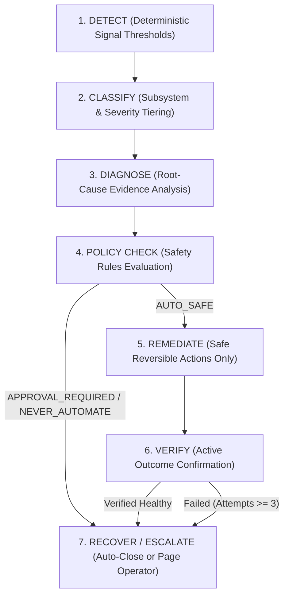

# Nexus Phase 34: Bounded Autonomous Self-Healing & Policy Engine

## Self-Healing Loop Architecture

Self-healing in Nexus operates under strict safety and rate boundaries:

---

## 1. Remediation Policy Engine

Every candidate remediation action is strictly governed by a 3-tier safety policy matrix:

### A. AUTO_SAFE (Autonomous Execution Allowed)
- `DEPRIORITIZE_PROVIDER`: Reduce routing weight for rate-limited / high-latency providers.
- `RESTORE_PROVIDER`: Restore routing weight once health checks pass.
- `MARK_STALE_MODEL`: Mark retired models as unavailable to prevent routing errors.
- `TRIGGER_MODEL_REDISCOVERY`: Trigger asynchronous provider model refresh.
- `ROTATE_TO_HEALTHY_KEY`: Advance to the next active key for the provider.
- `ENFORCE_KEY_COOLDOWN`: Place exhausted keys into temporal cooldown backoff.
- `PROBE_AGENT_HEALTH`: Dispatch a smoke probe to local agent sub-process.
- `REFRESH_AGENT_DISCOVERY`: Re-scan local PATH and executables.
- `RELEASE_STALE_AGENT_LEASE`: Reclaim orphaned execution leases.
- `RECONCILE_MISSION_STATE`: Cleanly reconcile interrupted DAG missions using checkpoints.
- `INVALIDATE_CACHE`: Invalidate corrupted exact-match or semantic cache entries.

### B. APPROVAL_REQUIRED (Human-in-the-Loop Operator Gate)
- `UPDATE_CREDENTIALS`: Rotating or changing stored provider credentials.
- `RETRY_MISSION_PIPELINE`: Re-running full mission pipelines after multi-failure.
- `DRAIN_PROVIDER_TRAFFIC`: Completely taking a provider offline across all routes.
- `OVERRIDE_CIRCUIT_BREAKER`: Forcing open or closed circuit breakers manually.

### C. NEVER_AUTOMATE (Strictly Forbidden from Automated Execution)
- Shell commands execution.
- Filesystem deletion (user workspaces, models cache, logs).
- Software/binary installation (`npm install`, `brew install`, `pip install`).
- Network/firewall modifications.
- Destructive database actions (dropping tables, deleting persistent records).
- Bypassing RBAC or security audit logs.

---

## 2. Remediation Verification

Nexus **never** assumes an action succeeded simply because the function executed. Every remediation requires independent verification:

1. **Provider Degradation Remediated**:
   - Verification: Sends synthetic health check request to provider endpoint.
   - Success condition: Upstream HTTP 200 within latency bounds.
2. **Model Stale Marked**:
   - Verification: Registry inspection confirms model is excluded from active routable set.
3. **Agent Offline Remediated**:
   - Verification: Executes agent `--version` or ping smoke probe.
   - Success condition: Zero exit code within 3000ms.
4. **Mission Recovery**:
   - Verification: Persistence checkpoint confirms clean state transition without data loss.

---

## 3. Loop Termination & Escalation

- **Bounded Attempts**: Maximum autonomous remediation attempts default to **3**.
- **Infinite Loop Prevention**: If attempts reach 3 without verification success, the incident transitions immediately to `ESCALATED` and autonomous retries stop.
- **Audited Control**: All operator actions (`acknowledge`, `approve`, `remediate`, `resolve`, `escalate`) append immutable entries into SQLite durable persistence and audit logs.
