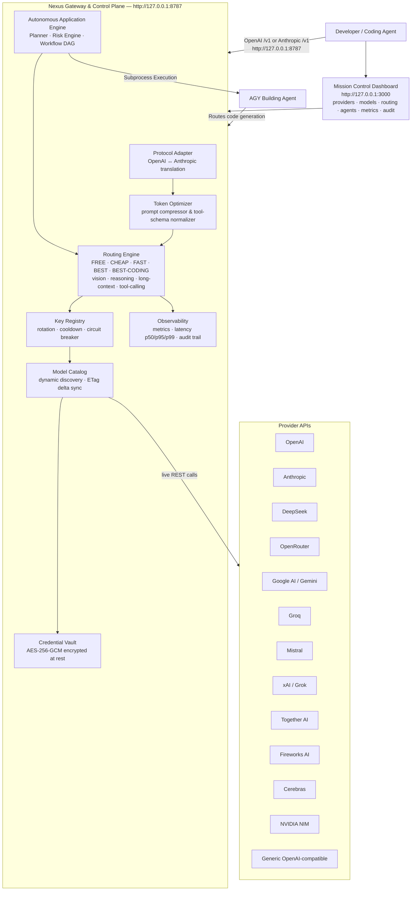

<div align="center">

# Nexus

**Universal AI Coding-Agent Gateway & Autonomous Control Plane**

[](https://github.com/rachidSabah/codingghosts/actions/workflows/ci.yml)
[](LICENSE)
[](https://nodejs.org)
[](https://pnpm.io)
[](CHANGELOG.md)

*Nexus is not an AI model. Nexus is the universal provider fabric and infrastructure layer between your coding agents and every model provider.*

<br/>


</div>

---

## What is Nexus?

Nexus is a **universal AI coding-agent gateway, provider fabric, and autonomous control plane** that dynamically discovers models across providers and exposes them through one OpenAI-compatible and Anthropic-compatible local endpoint (`http://127.0.0.1:8787`).

You point **one URL** at Nexus. Nexus handles everything else:

- **Universal Provider Fabric:** Connect any OpenAI-compatible provider once — Nexus automatically discovers models, normalizes capabilities, encrypts keys, and creates instant routing bindings.
- **Dynamic Model Discovery:** Discovers every model from every provider you configure — automatically, with zero hardcoded catalogs.
- **Intelligent Routing:** Routes each request to the best available, healthy, cost-appropriate model using policies like `nexus/best-coding`, `nexus/free`, `nexus/fast`, and `nexus/reasoning`.
- **Multi-Key Rotation & Cooldown:** Rotates API keys, isolates 429 rate limits, and automatically fails over across models, keys, and providers.
- **Protocol Translation:** Transparently projects OpenAI `/v1/chat/completions` and Anthropic `/v1/messages` requests to any upstream provider with streaming SSE support.
- **Token Optimization:** Prompt compression and tool-schema normalization run directly in the gateway with real-time measured token savings.
- **AGY Application Builder:** Autonomous software building lifecycle (plan, scaffold, build, test, verify, repair) orchestrated through the Nexus control plane.

**Nexus is the control plane — not another coding agent.**

---

## Architecture



---

## Why Nexus?

| Problem | Nexus Solution |
|---|---|
| Rate limits hit on one provider | Fans load across every configured key and provider automatically |
| Paying for GPT-4 on routine tasks | `nexus/free` and `nexus/cheap` route to the best free/cheap model |
| API keys expire or get rate-limited | Key Registry rotates keys and cools them down on 429 / 401 |
| Agents support only one base URL | One local endpoint serves all agents simultaneously |
| New models released constantly | Dynamic discovery — no restarts, no config file edits |
| Tool-calling schemas differ by provider | Gateway normalizes schemas before routing |
| Context window wasted on boilerplate | Prompt compressor runs before routing; reports measured savings |
| Multi-step application construction | Autonomous Application Engine coordinates planning, AGY scaffolding, and testing |

---

## Quick Start

### Windows (PowerShell)

```powershell
irm https://raw.githubusercontent.com/rachidSabah/codingghosts/main/scripts/install.ps1 | iex
```

### Linux / WSL / macOS (bash)

```bash
curl -fsSL https://raw.githubusercontent.com/rachidSabah/codingghosts/main/scripts/install.sh | bash
```

Both installers verify Node.js >= 20, clone the repo, install pnpm if missing, build from source, initialize `~/.agent-nexus`, generate an encrypted vault key, start the gateway, and print the dashboard URL.

### From Source

```bash
# Prerequisites: Node.js >= 20, pnpm >= 9
git clone https://github.com/rachidSabah/codingghosts.git
cd codingghosts
pnpm install
pnpm build

# Start the gateway (port 8787)
node apps/gateway/dist/bin.js

# Start the dashboard (port 3000) — separate terminal
pnpm --filter @anx/dashboard dev
```

### Docker

```bash
docker compose up
```

Gateway: `http://127.0.0.1:8787` · Dashboard: `http://127.0.0.1:3000`

---

## First-Run Experience

1. **Open the Dashboard:** Navigate to `http://127.0.0.1:3000`.
2. **Add a Provider:** Enter your API key (stored encrypted in `~/.agent-nexus/vault.json`).
3. **Model Discovery:** Nexus immediately contacts the provider, discovers all accessible models, classifies their capabilities, and registers them in the dynamic catalog.
4. **Point Your Coding Agent:** Configure your favorite coding agent to use `http://127.0.0.1:8787/v1` as its base URL.
5. **Start Coding:** Use high-level aliases such as `nexus/best-coding` or direct model IDs.

---

## Connecting Coding Agents

Nexus provides drop-in compatibility for all major coding agents:

| Agent | Config File | Setting | Protocol |
|---|---|---|---|
| **Claude Code** | `~/.claude/settings.json` | `"apiBaseUrl": "http://127.0.0.1:8787"` | Anthropic `/v1/messages` |
| **Codex CLI** | `~/.codex/config.json` | `"baseUrl": "http://127.0.0.1:8787/v1"` | OpenAI `/v1/chat/completions` |
| **Gemini CLI** | `~/.gemini/settings.json` | `"baseUrl": "http://127.0.0.1:8787/v1"` | OpenAI-compatible |
| **OpenCode** | `~/.opencode.json` | `"url": "http://127.0.0.1:8787/v1"` | OpenAI-compatible |
| **Qwen Code / Kimi Code** | Agent config / env | `OPENAI_BASE_URL=http://127.0.0.1:8787/v1` | OpenAI-compatible |
| **Aider** | Command-line | `--openai-api-base http://127.0.0.1:8787/v1` | OpenAI-compatible |
| **Cursor / Windsurf** | Settings → Models | Override Base URL: `http://127.0.0.1:8787/v1` | OpenAI-compatible |
| **Cline / Roo Code** | Extension Settings | API Provider: OpenAI-compatible, URL: `http://127.0.0.1:8787/v1` | OpenAI-compatible |
| **AGY** | Native Port | Auto-bound via `AgyBuilderAdapter` | Control Plane Native |

> **Tip:** You can also auto-configure detected agents with one command:  
> `node apps/gateway/dist/bin.js integrations install --all`

## One-Minute Automated Install

### Windows (PowerShell)
```powershell
irm https://raw.githubusercontent.com/rachidSabah/codingghosts/main/install.ps1 | iex
```

### Linux & macOS (Bash)
```bash
curl -fsSL https://raw.githubusercontent.com/rachidSabah/codingghosts/main/install.sh | bash
```

---

## Routing Policy Aliases

Instead of hardcoding a specific provider model, point your agent at Nexus policy aliases:

| Policy Alias | Selection Strategy |
|---|---|
| `nexus/best-coding` | Highest-ranked coding-optimized model available |
| `nexus/free` | Best healthy free-tier model across all connected providers |
| `nexus/cheap` | Lowest-cost healthy model meeting token & capability requirements |
| `nexus/fast` | Lowest-latency healthy model |
| `nexus/best` | Highest general quality model |
| `nexus/reasoning` | Best reasoning / chain-of-thought model |
| `nexus/vision` | Best vision-capable model |
| `nexus/long-context` | Best model for large context windows (>128k tokens) |

---

## Durable Runtime & Crash Recovery (Phase 32)

Nexus v0.5.0 features a local-first **Durable Persistence & Recovery Engine**:
- **ACID Durability**: Schema-versioned SQLite database with atomic JSON write boundaries.
- **Interrupted Mission Recovery**: Auto-reconciles in-flight DAG tasks upon process reboot or crash.
- **Orphan Subprocess Reconciliation**: Detects dead agent PIDs and cleans up abandoned execution leases.
- **Idempotency Protection**: SHA-256 request hashing prevents duplicate executions during network retries.
- **Cryptographic Backups**: Portable backup bundles validated by SHA-256 integrity checksums.

---

## REST API Summary

| Method | Path | Description |
|---|---|---|
| `POST` | `/v1/chat/completions` | OpenAI-compatible chat completions with routing extensions |
| `POST` | `/v1/messages` | Anthropic-compatible Messages API |
| `GET` | `/v1/models` | All discovered models across all healthy providers |
| `GET` | `/v1/providers` | Configured provider health, models, and latency |
| `POST` | `/v1/missions` | Dispatch autonomous multi-agent engineering missions (Idempotent) |
| `GET` | `/v1/missions/:id/checkpoints` | Inspect immutable DAG execution checkpoints |
| `GET` | `/v1/system/health` | Truthful 14-subsystem health matrix |
| `GET` | `/v1/system/diagnostics` | Deep system diagnostics with automated root-cause analysis |
| `GET` | `/v1/system/recovery` | Crash recovery status & in-flight interrupted missions |
| `POST` | `/v1/system/recovery/reconcile` | Operator mission recovery actions (RESUME, RETRY, CANCEL) |
| `POST` | `/v1/system/backup` | Generate verified system backup snapshot bundle |
| `POST` | `/v1/system/restore` | Restore platform state from backup bundle |
| `GET` | `/v1/system/events` | Real-time Server-Sent Events (SSE) telemetry stream |

Full API reference: [`docs/API.md`](docs/API.md)

---

## Official 32-Topic Wiki Documentation

The complete, in-depth documentation is available in [`docs/wiki/`](docs/wiki/):

| Chapter | Topic | Link |
|---|---|---|
| 01 | Introduction & Overview | [`01-introduction-and-overview.md`](docs/wiki/01-introduction-and-overview.md) |
| 02 | Architecture & Mental Model | [`02-architecture-and-mental-model.md`](docs/wiki/02-architecture-and-mental-model.md) |
| 03 | Quickstart & Installation | [`03-quickstart-and-installation.md`](docs/wiki/03-quickstart-and-installation.md) |
| 04 | Universal Provider Fabric | [`04-universal-provider-fabric.md`](docs/wiki/04-universal-provider-fabric.md) |
| 05 | Dynamic Model Discovery | [`05-dynamic-model-discovery.md`](docs/wiki/05-dynamic-model-discovery.md) |
| 06 | Autonomous Intelligent Routing | [`06-autonomous-intelligent-routing.md`](docs/wiki/06-autonomous-intelligent-routing.md) |
| 07 | Smart Model Aliasing | [`07-smart-model-aliasing.md`](docs/wiki/07-smart-model-aliasing.md) |
| 08 | Key Rotation & Cooldown | [`08-key-rotation-and-cooldown.md`](docs/wiki/08-key-rotation-and-cooldown.md) |
| 09 | Encrypted Credential Vault | [`09-encrypted-credential-vault.md`](docs/wiki/09-encrypted-credential-vault.md) |
| 10 | Universal Local Agent Bridge | [`10-universal-local-agent-bridge.md`](docs/wiki/10-universal-local-agent-bridge.md) |
| 11 | Agent Orchestrator & Pool | [`11-agent-orchestrator-and-pool.md`](docs/wiki/11-agent-orchestrator-and-pool.md) |
| 12 | Unified Mission Orchestration | [`12-unified-mission-orchestration.md`](docs/wiki/12-unified-mission-orchestration.md) |
| 13 | Mission DAG & Parallel Execution | [`13-mission-dag-and-parallel-execution.md`](docs/wiki/13-mission-dag-and-parallel-execution.md) |
| 14 | Autonomous Verification & Repair | [`14-autonomous-verification-and-repair.md`](docs/wiki/14-autonomous-verification-and-repair.md) |
| 15 | Durable Runtime & Persistence | [`15-durable-runtime-and-persistence.md`](docs/wiki/15-durable-runtime-and-persistence.md) |
| 16 | Crash Recovery & Reconciliation | [`16-crash-recovery-and-reconciliation.md`](docs/wiki/16-crash-recovery-and-reconciliation.md) |
| 17 | Idempotency & Side-Effect Safety | [`17-idempotency-and-side-effect-safety.md`](docs/wiki/17-idempotency-and-side-effect-safety.md) |
| 18 | Backup & Disaster Recovery | [`18-backup-and-disaster-recovery.md`](docs/wiki/18-backup-and-disaster-recovery.md) |
| 19 | Operations Control Plane | [`19-operations-control-plane.md`](docs/wiki/19-operations-control-plane.md) |
| 20 | Observability, Metrics & Traces | [`20-observability-metrics-and-traces.md`](docs/wiki/20-observability-metrics-and-traces.md) |
| 21 | Realtime Events & Telemetry Streaming | [`21-realtime-events-and-telemetry-streaming.md`](docs/wiki/21-realtime-events-and-telemetry-streaming.md) |
| 22 | Production Operations Dashboard | [`22-production-operations-dashboard.md`](docs/wiki/22-production-operations-dashboard.md) |
| 23 | Security, RBAC & Isolation | [`23-security-rbac-and-isolation.md`](docs/wiki/23-security-rbac-and-isolation.md) |
| 24 | Token Efficiency & Prompt Compression | [`24-token-efficiency-and-prompt-compression.md`](docs/wiki/24-token-efficiency-and-prompt-compression.md) |
| 25 | RAG & Long-Term Memory | [`25-rag-and-long-term-memory.md`](docs/wiki/25-rag-and-long-term-memory.md) |
| 26 | Tool Runtime & MCP Integration | [`26-tool-runtime-and-mcp-integration.md`](docs/wiki/26-tool-runtime-and-mcp-integration.md) |
| 27 | Agent Teams & Collaboration | [`27-agent-teams-and-collaboration.md`](docs/wiki/27-agent-teams-and-collaboration.md) |
| 28 | Service Mesh & Traffic Shaping | [`28-service-mesh-and-traffic-shaping.md`](docs/wiki/28-service-mesh-and-traffic-shaping.md) |
| 29 | CLI Reference & Automation | [`29-cli-reference-and-automation.md`](docs/wiki/29-cli-reference-and-automation.md) |
| 30 | Configuration & Environment Variables | [`30-configuration-and-environment-variables.md`](docs/wiki/30-configuration-and-environment-variables.md) |
| 31 | Troubleshooting & Runbooks | [`31-troubleshooting-and-runbooks.md`](docs/wiki/31-troubleshooting-and-runbooks.md) |
| 32 | Contributing & Plugin Development | [`32-contributing-and-plugin-development.md`](docs/wiki/32-contributing-and-plugin-development.md) |

---

## Security

- Provider API keys are **encrypted at rest** in `~/.agent-nexus/vault.json` using AES-256-GCM.
- Keys are **never logged**, never forwarded across providers, and never returned in API responses.
- Continuous CI secret scanning via **Gitleaks** on every push.

---

## License

[Apache-2.0](LICENSE) © Nexus Contributors

