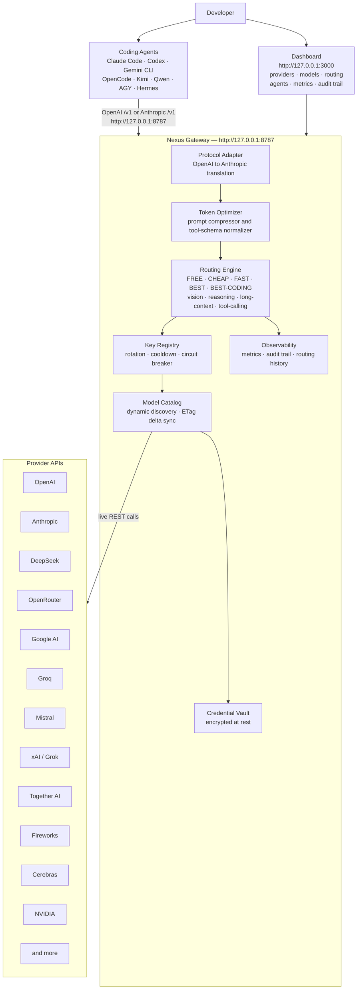

<div align="center">

# Nexus

**Universal AI Coding-Agent Gateway &amp; Autonomous Control Plane**

[](https://github.com/rachidSabah/codingghosts/actions/workflows/ci.yml)
[](LICENSE)
[](https://nodejs.org)
[](https://pnpm.io)
[](CHANGELOG.md)

*Nexus is not an AI model. Nexus is the infrastructure layer between your coding agents and every model provider.*

</div>

---

## What is Nexus?

Nexus is a **universal AI coding-agent gateway and autonomous control plane** that dynamically discovers models across providers and exposes them through one OpenAI-compatible and agent-compatible local endpoint.

You point **one URL** at Nexus. Nexus handles everything else:

- Discovers every model from every provider you configure — automatically, with no hardcoded catalog.
- Routes each request to the best available, healthy, cost-appropriate model.
- Rotates API keys, cools down on 429s, and fails over across models, keys, and providers.
- Projects each provider's catalog into the protocol your coding agent expects.
- Reports token savings from prompt compression and tool-schema normalization.
- Surfaces every discovered model to every compatible agent through a single gateway.

**Nexus is the control plane — not another coding agent.**

---

## Architecture



---

## Why Nexus?

| Problem | Nexus solution |
|---|---|
| Rate limits hit on one provider | Fans load across every configured key and provider automatically |
| Paying for GPT-4 on routine tasks | `nexus/free` and `nexus/cheap` route to the best free/cheap model |
| API keys expire or get rate-limited | Key Registry rotates keys and cools them down on 429 / 401 |
| Agents support only one base URL | One local endpoint serves all agents simultaneously |
| New models released constantly | Dynamic discovery — no restarts, no config file edits |
| Tool-calling schemas differ by provider | Gateway normalizes schemas before routing |
| Context window wasted on boilerplate | Prompt compressor runs before routing; reports measured savings |

---

## Feature matrix

| Feature | Status |
|---|---|
| Dynamic model discovery (zero hardcoded catalog) | ✅ |
| Multi-provider simultaneous | ✅ |
| Multi-key rotation per provider | ✅ |
| Automatic failover: model → key → provider → alt-model | ✅ |
| Routing policies: FREE / CHEAP / FAST / BEST / BEST-CODING | ✅ |
| Capability routing: vision · reasoning · long-context · tool-calling | ✅ |
| OpenAI-compatible `/v1/chat/completions` (streaming + non-streaming) | ✅ |
| Anthropic `/v1/messages` (streaming + non-streaming) | ✅ |
| Responses API (`/v1/responses`) | ✅ |
| Claude Code — live-verified | ✅ |
| Codex CLI — live-verified | ✅ |
| OpenCode — detected | ✅ |
| Gemini CLI — detected | ✅ |
| AGY / Hermes — native building-agent integration | ✅ |
| Token optimization (prompt compressor + tool-schema normalizer) | ✅ |
| Catalog delta sync (ETag / 304) | ✅ |
| Encrypted credential vault | ✅ |
| Mission Control dashboard (25+ pages) | ✅ |
| MCP server + client | ✅ |
| Agent-to-Agent (A2A) coordination | ✅ |
| Workflow DAG engine | ✅ |
| Autonomous Application Engine | ✅ |
| Observability (metrics · latency · audit trail) | ✅ |
| Windows (PowerShell one-liner) | ✅ |
| WSL / Linux / macOS (curl one-liner) | ✅ |
| Docker | ✅ |
| CI: secret scan + lint + typecheck + test + build | ✅ |

---

## Quick start

### Windows (PowerShell)

```powershell
irm https://raw.githubusercontent.com/rachidSabah/codingghosts/main/scripts/install.ps1 | iex
```

### Linux / WSL / macOS (bash)

```bash
curl -fsSL https://raw.githubusercontent.com/rachidSabah/codingghosts/main/scripts/install.sh | bash
```

Both installers verify Node.js >= 20, clone the repo, build it, create `~/.agent-nexus`, generate an encrypted vault key, start the gateway, and print the dashboard URL.

### From source

```bash
# Prerequisites: Node.js >= 20, pnpm >= 9
git clone https://github.com/rachidSabah/codingghosts.git
cd codingghosts
pnpm install
pnpm build

# Start the gateway (port 8787)
node apps/gateway/dist/bin.js

# Start the dashboard (port 3000) — separate terminal
pnpm --filter @anx/dashboard dev
```

### Docker

```bash
docker compose up
```

Gateway: `http://127.0.0.1:8787` · Dashboard: `http://127.0.0.1:3000`

---

## First run

1. **Open the dashboard** at `http://127.0.0.1:3000`.
2. **Add a provider** → enter your API key. It is stored encrypted in `~/.agent-nexus/vault.json` — never logged or forwarded.
3. **Model discovery runs immediately** — no restart, no manual catalog edit. Every model the provider exposes appears in the Discovered Models table.
4. **Configure your coding agent** to point at Nexus:

### Agent configuration

| Agent | Config location | Setting |
|---|---|---|
| **Claude Code** | `~/.claude/settings.json` | `"apiBaseUrl": "http://127.0.0.1:8787"` |
| **Codex CLI** | `~/.codex/config.json` | `"baseUrl": "http://127.0.0.1:8787/v1"` |
| **Gemini CLI** | `~/.gemini/settings.json` | `"baseUrl": "http://127.0.0.1:8787/v1"` |
| **OpenCode** | `~/.opencode.json` | `"url": "http://127.0.0.1:8787/v1"` |
| **Cursor / Windsurf / Cline** | Settings → Base URL | `http://127.0.0.1:8787/v1` |
| **Any OpenAI-compatible agent** | Base URL setting | `http://127.0.0.1:8787/v1` |

> Or use the dashboard **Integrations** page to auto-configure any detected agent with one click.

5. **Select a routing policy** — e.g. `nexus/best-coding` — and start coding.

### Routing policy aliases

| Policy alias | Picks |
|---|---|
| `nexus/free` | Best healthy free-tier model across all providers |
| `nexus/cheap` | Lowest-cost model that meets the request requirements |
| `nexus/fast` | Lowest-latency healthy model |
| `nexus/best` | Highest-quality model available |
| `nexus/best-coding` | Highest-quality coding-optimised model |
| `nexus/reasoning` | Best reasoning / chain-of-thought model |
| `nexus/vision` | Best vision-capable model |
| `nexus/long-context` | Best model for very long context windows |

---

## CLI reference

The `anx-gateway` binary exposes diagnostic subcommands:

```bash
node apps/gateway/dist/bin.js status      # gateway health + uptime
node apps/gateway/dist/bin.js doctor      # connectivity, providers, models
node apps/gateway/dist/bin.js models      # discovered model count + free tier
node apps/gateway/dist/bin.js providers   # active providers + model counts
node apps/gateway/dist/bin.js agents      # detected coding agents + status
```

---

## REST API (key endpoints)

| Method | Path | Description |
|---|---|---|
| `POST` | `/v1/chat/completions` | OpenAI-compatible chat completions |
| `POST` | `/v1/messages` | Anthropic-compatible messages |
| `POST` | `/v1/responses` | Responses API |
| `GET` | `/v1/models` | All discovered models |
| `GET` | `/v1/catalog/status` | Model/provider counts, catalog version |
| `GET` | `/v1/catalog/delta` | Delta sync (ETag / 304) |
| `GET` | `/v1/providers` | Configured providers + health |
| `GET` | `/v1/runtime-agents` | Detected coding agents |
| `POST` | `/v1/runtime-agents/:id/configure` | Auto-configure an agent |
| `GET` | `/v1/debug/observability` | Latency p50/p95/p99, token savings, routing |
| `GET` | `/v1/debug/routing/recent` | Recent routing decisions |
| `GET` | `/v1/openapi.json` | OpenAPI 3.0 specification |

Full API reference: [`docs/API.md`](docs/API.md)

---

## Supported providers

OpenAI · Anthropic · DeepSeek · OpenRouter · Google AI (Gemini) · Groq · Mistral · xAI (Grok) · Together AI · Fireworks AI · Cerebras · NVIDIA NIM · Azure OpenAI · Cloudflare AI

Provider onboarding guide: [`docs/PROVIDERS.md`](docs/PROVIDERS.md)

---

## Documentation

| Document | Description |
|---|---|
| [`docs/ARCHITECTURE.md`](docs/ARCHITECTURE.md) | Full subsystem diagram and data flow |
| [`docs/PROVIDERS.md`](docs/PROVIDERS.md) | Adding and configuring providers |
| [`docs/API.md`](docs/API.md) | Complete REST API reference |
| [`docs/ROUTING.md`](docs/ROUTING.md) | Routing engine, policies, and scoring |
| [`docs/INTEGRATIONS.md`](docs/INTEGRATIONS.md) | Coding agent integration guides |
| [`docs/WORKFLOW.md`](docs/WORKFLOW.md) | Workflow DAG engine and DAG syntax |
| [`docs/AGENT_DEV.md`](docs/AGENT_DEV.md) | Building custom agents on top of Nexus |
| [`docs/PLUGINS.md`](docs/PLUGINS.md) | Plugin system and extension marketplace |
| [`SECURITY.md`](SECURITY.md) | Security policy and reporting vulnerabilities |
| [`CONTRIBUTING.md`](CONTRIBUTING.md) | How to contribute |
| [`CHANGELOG.md`](CHANGELOG.md) | Release history |

---

## Security

- Provider API keys are **encrypted at rest** in `~/.agent-nexus/vault.json`.
- Keys are **never logged**, never forwarded across providers, and never appear in traces.
- CI runs **gitleaks** on every push — commits containing detected secrets are blocked.
- The dashboard API is protected by an admin key (`ANX_ADMIN_API_KEY`).

Report vulnerabilities: see [`SECURITY.md`](SECURITY.md).

---

## Contributing

See [`CONTRIBUTING.md`](CONTRIBUTING.md). PRs, issues, and provider adapters are welcome.

```bash
pnpm install
pnpm dev        # starts all packages in watch mode
pnpm test       # run all tests
pnpm lint       # lint
pnpm typecheck  # typecheck
```

---

## License

[MIT](LICENSE) © Nexus contributors
