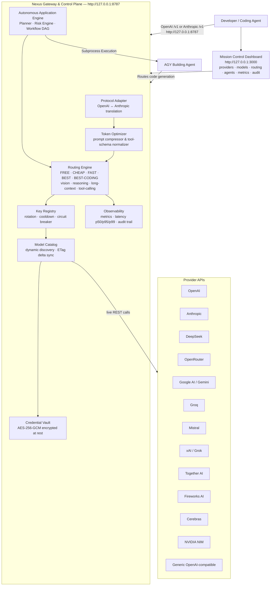

<div align="center">

# Nexus

**Universal AI Coding-Agent Gateway & Autonomous Control Plane**

[](https://github.com/rachidSabah/codingghosts/actions/workflows/ci.yml)
[](LICENSE)
[](https://nodejs.org)
[](https://pnpm.io)
[](CHANGELOG.md)

*Nexus is not an AI model. Nexus is the infrastructure layer between your coding agents and every model provider.*

<br/>


</div>

---

## What is Nexus?

Nexus is a **universal AI coding-agent gateway and autonomous control plane** that dynamically discovers models across providers and exposes them through one OpenAI-compatible and Anthropic-compatible local endpoint (`http://127.0.0.1:8787`).

You point **one URL** at Nexus. Nexus handles everything else:

- **Dynamic Model Discovery:** Discovers every model from every provider you configure — automatically, with zero hardcoded catalogs.
- **Intelligent Routing:** Routes each request to the best available, healthy, cost-appropriate model using policies like `nexus/best-coding`, `nexus/free`, `nexus/fast`, and `nexus/reasoning`.
- **Multi-Key Rotation & Cooldown:** Rotates API keys, isolates 429 rate limits, and automatically fails over across models, keys, and providers.
- **Protocol Translation:** Transparently projects OpenAI `/v1/chat/completions` and Anthropic `/v1/messages` requests to any upstream provider with streaming SSE support.
- **Token Optimization:** Prompt compression and tool-schema normalization run directly in the gateway with real-time measured token savings.
- **AGY Application Builder:** Autonomous software building lifecycle (plan, scaffold, build, test, verify, repair) orchestrated through the Nexus control plane.

**Nexus is the control plane — not another coding agent.**

---

## Architecture



---

## Why Nexus?

| Problem | Nexus Solution |
|---|---|
| Rate limits hit on one provider | Fans load across every configured key and provider automatically |
| Paying for GPT-4 on routine tasks | `nexus/free` and `nexus/cheap` route to the best free/cheap model |
| API keys expire or get rate-limited | Key Registry rotates keys and cools them down on 429 / 401 |
| Agents support only one base URL | One local endpoint serves all agents simultaneously |
| New models released constantly | Dynamic discovery — no restarts, no config file edits |
| Tool-calling schemas differ by provider | Gateway normalizes schemas before routing |
| Context window wasted on boilerplate | Prompt compressor runs before routing; reports measured savings |
| Multi-step application construction | Autonomous Application Engine coordinates planning, AGY scaffolding, and testing |

---

## Quick Start

### Windows (PowerShell)

```powershell
irm https://raw.githubusercontent.com/rachidSabah/codingghosts/main/scripts/install.ps1 | iex
```

### Linux / WSL / macOS (bash)

```bash
curl -fsSL https://raw.githubusercontent.com/rachidSabah/codingghosts/main/scripts/install.sh | bash
```

Both installers verify Node.js >= 20, clone the repo, install pnpm if missing, build from source, initialize `~/.agent-nexus`, generate an encrypted vault key, start the gateway, and print the dashboard URL.

### From Source

```bash
# Prerequisites: Node.js >= 20, pnpm >= 9
git clone https://github.com/rachidSabah/codingghosts.git
cd codingghosts
pnpm install
pnpm build

# Start the gateway (port 8787)
node apps/gateway/dist/bin.js

# Start the dashboard (port 3000) — separate terminal
pnpm --filter @anx/dashboard dev
```

### Docker

```bash
docker compose up
```

Gateway: `http://127.0.0.1:8787` · Dashboard: `http://127.0.0.1:3000`

---

## First-Run Experience

1. **Open the Dashboard:** Navigate to `http://127.0.0.1:3000`.
2. **Add a Provider:** Enter your API key (stored encrypted in `~/.agent-nexus/vault.json`).
3. **Model Discovery:** Nexus immediately contacts the provider, discovers all accessible models, classifies their capabilities, and registers them in the dynamic catalog.
4. **Point Your Coding Agent:** Configure your favorite coding agent to use `http://127.0.0.1:8787/v1` as its base URL.
5. **Start Coding:** Use high-level aliases such as `nexus/best-coding` or direct model IDs.

---

## Connecting Coding Agents

Nexus provides drop-in compatibility for all major coding agents:

| Agent | Config File | Setting | Protocol |
|---|---|---|---|
| **Claude Code** | `~/.claude/settings.json` | `"apiBaseUrl": "http://127.0.0.1:8787"` | Anthropic `/v1/messages` |
| **Codex CLI** | `~/.codex/config.json` | `"baseUrl": "http://127.0.0.1:8787/v1"` | OpenAI `/v1/chat/completions` |
| **Gemini CLI** | `~/.gemini/settings.json` | `"baseUrl": "http://127.0.0.1:8787/v1"` | OpenAI-compatible |
| **OpenCode** | `~/.opencode.json` | `"url": "http://127.0.0.1:8787/v1"` | OpenAI-compatible |
| **Qwen Code / Kimi Code** | Agent config / env | `OPENAI_BASE_URL=http://127.0.0.1:8787/v1` | OpenAI-compatible |
| **Aider** | Command-line | `--openai-api-base http://127.0.0.1:8787/v1` | OpenAI-compatible |
| **Cursor / Windsurf** | Settings → Models | Override Base URL: `http://127.0.0.1:8787/v1` | OpenAI-compatible |
| **Cline / Roo Code** | Extension Settings | API Provider: OpenAI-compatible, URL: `http://127.0.0.1:8787/v1` | OpenAI-compatible |
| **AGY** | Native Port | Auto-bound via `AgyBuilderAdapter` | Control Plane Native |

> **Tip:** You can also auto-configure detected agents with one command:  
> `node apps/gateway/dist/bin.js integrations install --all`

---

## Routing Policy Aliases

Instead of hardcoding a specific provider model, point your agent at Nexus policy aliases:

| Policy Alias | Selection Strategy |
|---|---|
| `nexus/best-coding` | Highest-ranked coding-optimized model available |
| `nexus/free` | Best healthy free-tier model across all connected providers |
| `nexus/cheap` | Lowest-cost healthy model meeting token & capability requirements |
| `nexus/fast` | Lowest-latency healthy model |
| `nexus/best` | Highest general quality model |
| `nexus/reasoning` | Best reasoning / chain-of-thought model |
| `nexus/vision` | Best vision-capable model |
| `nexus/long-context` | Best model for large context windows (>128k tokens) |

---

## AGY Application Builder

Nexus includes an **Autonomous Application Builder** that executes end-to-end software construction in isolated workspaces:

```
USER ──► NEXUS ──► APPLICATION ENGINE ──► PLANNER ──► RISK ENGINE ──► WORKFLOW ──► AGY ──► NEXUS ROUTING ──► MODELS
```

- **AGY is the Building Agent:** Responsible for project scaffolding, code implementation, test execution, inspection, and repair.
- **Nexus is the Control Plane:** Responsible for specification generation, DAG planning, approval gate enforcement, model routing, API key rotation, artifact verification, and telemetry.

To create an application:
```bash
curl -X POST http://127.0.0.1:8787/v1/applications \
  -H "Content-Type: application/json" \
  -d '{"objective": "Build a high-performance URL shortener with SQLite and Fastify"}'
```

---

## Supported Providers & Generic Endpoints

Nexus supports all major providers natively plus any custom OpenAI-compatible endpoint:

- **Native Providers:** OpenAI, Anthropic, DeepSeek, Google Gemini, Groq, Mistral, xAI (Grok), Together AI, Fireworks AI, Cerebras, NVIDIA NIM, Azure OpenAI, Cloudflare AI, OpenRouter.
- **Generic OpenAI-Compatible Endpoints:** Any standard API exposing `/v1/models` and `/v1/chat/completions` (e.g., LocalAI, vLLM, Ollama, LM Studio) can be connected through the dashboard or `.env`.

---

## REST API Summary

| Method | Path | Description |
|---|---|---|
| `POST` | `/v1/chat/completions` | OpenAI-compatible chat completions with routing extensions |
| `POST` | `/v1/messages` | Anthropic-compatible Messages API |
| `GET` | `/v1/models` | All discovered models across all healthy providers |
| `GET` | `/v1/catalog/status` | Model/provider counts and active catalog version |
| `GET` | `/v1/catalog/delta` | Delta synchronization (`ETag` / `304 Not Modified`) |
| `GET` | `/v1/providers` | Configured provider health, models, and latency |
| `GET` | `/v1/runtime-agents` | Detected coding agent status on the host system |
| `POST` | `/v1/applications` | Create a new autonomous software build project |
| `GET` | `/v1/debug/observability` | Real-time p50/p95/p99 latencies, token savings, and routing history |
| `GET` | `/v1/doctor` | Gateway diagnostic summary |

Full API reference: [`docs/API.md`](docs/API.md)

---

## Documentation Index

| Document | Description |
|---|---|
| [`docs/ARCHITECTURE.md`](docs/ARCHITECTURE.md) | Hexagonal architecture, ports, adapters, and data flows |
| [`docs/PROVIDERS.md`](docs/PROVIDERS.md) | Adding and configuring providers |
| [`docs/API.md`](docs/API.md) | Full REST API reference |
| [`docs/ROUTING.md`](docs/ROUTING.md) | Routing algorithms, scoring engine, and failover |
| [`docs/INTEGRATIONS.md`](docs/INTEGRATIONS.md) | In-depth agent configuration guides |
| [`docs/WORKFLOW.md`](docs/WORKFLOW.md) | Workflow DAG engine and tasks |
| [`docs/AGENT_DEV.md`](docs/AGENT_DEV.md) | Developing custom agent adapters |
| [`docs/PLUGINS.md`](docs/PLUGINS.md) | Plugin runtime and lifecycle hooks |
| [`NEXUS_PUBLIC_SECURITY_AUDIT.md`](NEXUS_PUBLIC_SECURITY_AUDIT.md) | Security audit and zero-secret guarantee |
| [`SECURITY.md`](SECURITY.md) | Vulnerability disclosure policy |
| [`CONTRIBUTING.md`](CONTRIBUTING.md) | Developer guide and quality gates |
| [`RELEASE_NOTES.md`](RELEASE_NOTES.md) | Release notes for v0.4.0 |
| [`CHANGELOG.md`](CHANGELOG.md) | Changelog history |

---

## Security

- Provider API keys are **encrypted at rest** in `~/.agent-nexus/vault.json` using AES-256-GCM.
- Keys are **never logged**, never forwarded across providers, and never returned in API responses.
- Continuous CI secret scanning via **Gitleaks** on every push.

---

## License

[Apache-2.0](LICENSE) © Nexus Contributors
