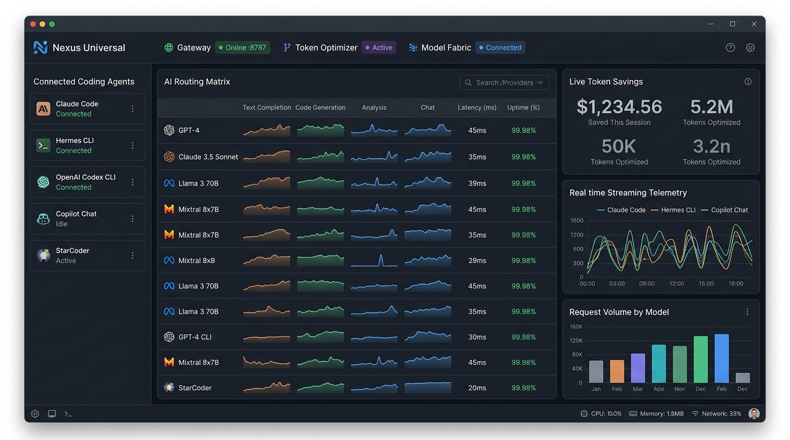
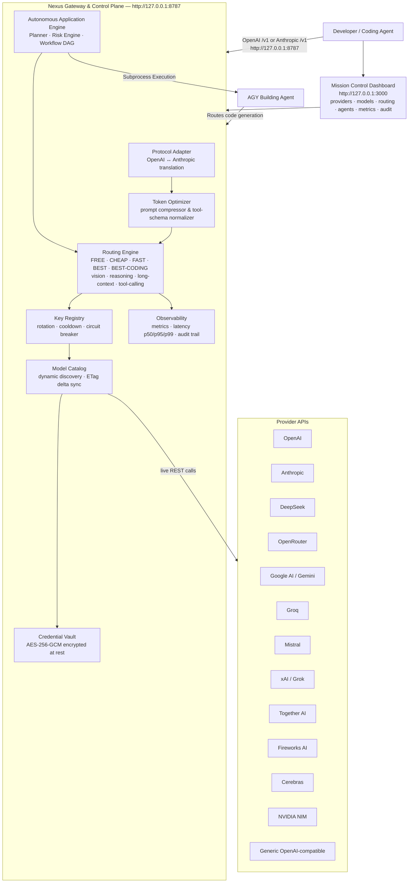

<div align="center">

# Nexus

**Universal AI Coding-Agent Gateway & Autonomous Control Plane**

[](https://github.com/rachidSabah/Nexus/actions/workflows/ci.yml)
[](LICENSE)
[](https://nodejs.org)
[](https://pnpm.io)
[](CHANGELOG.md)

*Nexus is not an AI model. Nexus is the universal provider fabric and infrastructure layer between your coding agents and every model provider.*

<br/>



</div>

---

## 🚀 What's New — Competitive Edge Over OmniRoute

Nexus now ships a set of **live, measured** dashboards that turn OmniRoute's static marketing claims into verifiable, per-request telemetry. Every number below is computed from the running gateway — no fabricated quotas, no synthetic fallbacks.

| Feature | Dashboard Route | What it proves (with real data) |
|---|---|---|
| **Compression Lab** | [`/compression`](docs/assets/nexus-compression.png) | Paste any prompt → see the **real per-engine token savings** (minify · dedupe · collapse-arrays · elide-middle) from the stacked `compressPipeline`. OmniRoute claims "15–95% savings" statically; Nexus shows *your* actual savings, live. |
| **Routing Decision Replay** | [`/routing-replay`](docs/assets/nexus-routing-replay.png) | Click any past request → inspect the **real fallback attempt chain** + the live candidate ranking and why the winner won. |
| **Cost & Budget Dashboard** | [`/cost-budget`](docs/assets/nexus-cost-budget.png) | Live token burn + per-provider throughput + a configurable **budget guard** with over/near-ceiling alerts (real `/v1/metrics`). |
| **Strategy A/B Simulator** | [`/strategy-sim`](docs/assets/nexus-strategy-sim.png) | Rank the same candidate pool under two routing strategies and compare outcomes side-by-side via the read-only `POST /v1/routing/compare`. |
| **Agent Health & Resilience Board** | [`/resilience`](docs/assets/nexus-resilience.png) | Circuit-open / degraded providers, detached long-tasks, and orchestrated-agent failovers in one ops view. |

> Screenshots above are captured from the live dashboard (`http://127.0.0.1:3000`) against a running gateway. Introduced in commits [`a4ed97f`](https://github.com/rachidSabah/Nexus/commit/a4ed97f) (Compression Lab) and [`2725c3a`](https://github.com/rachidSabah/Nexus/commit/2725c3a) (the four dashboards).

---

## What is Nexus?

Nexus is a **universal AI coding-agent gateway, provider fabric, and autonomous control plane** that dynamically discovers models across providers and exposes them through one OpenAI-compatible and Anthropic-compatible local endpoint (`http://127.0.0.1:8787`).

You point **one URL** at Nexus. Nexus handles everything else:

- **Universal Provider Fabric:** Connect any OpenAI-compatible provider once — Nexus automatically discovers models, normalizes capabilities, encrypts keys, and creates instant routing bindings.
- **Dynamic Model Discovery:** Discovers every model from every provider you configure — automatically, with zero hardcoded catalogs.
- **Intelligent Routing:** Routes each request to the best available, healthy, cost-appropriate model using policies like `nexus/best-coding`, `nexus/free`, `nexus/fast`, and `nexus/reasoning`.
- **Multi-Key Rotation & Cooldown:** Rotates API keys, isolates 429 rate limits, and automatically fails over across models, keys, and providers.
- **Protocol Translation:** Transparently projects OpenAI `/v1/chat/completions` and Anthropic `/v1/messages` requests to any upstream provider with streaming SSE support.
- **Token Optimization:** Prompt compression and tool-schema normalization run directly in the gateway with real-time measured token savings.
- **AGY Application Builder:** Autonomous software building lifecycle (plan, scaffold, build, test, verify, repair) orchestrated through the Nexus control plane.

**Nexus is the control plane — not another coding agent.**

---

## Architecture



---

## Why Nexus?

| Problem | Nexus Solution |
|---|---|
| Rate limits hit on one provider | Fans load across every configured key and provider automatically |
| Paying for GPT-4 on routine tasks | `nexus/free` and `nexus/cheap` route to the best free/cheap model |
| API keys expire or get rate-limited | Key Registry rotates keys and cools them down on 429 / 401 |
| Agents support only one base URL | One local endpoint serves all agents simultaneously |
| New models released constantly | Dynamic discovery — no restarts, no config file edits |
| Tool-calling schemas differ by provider | Gateway normalizes schemas before routing |
| Context window wasted on boilerplate | Prompt compressor runs before routing; reports measured savings |
| Multi-step application construction | Autonomous Application Engine coordinates planning, AGY scaffolding, and testing |

---

## Quick Start

### Windows (PowerShell)

```powershell
irm https://raw.githubusercontent.com/rachidSabah/Nexus/main/scripts/install.ps1 | iex
```

To completely remove Nexus (stops services, deletes the install dir + vault, unlinks the `anx` CLI):

```powershell
irm https://raw.githubusercontent.com/rachidSabah/Nexus/main/scripts/uninstall.ps1 | iex
```

### Linux / WSL / macOS (bash)

```bash
curl -fsSL https://raw.githubusercontent.com/rachidSabah/Nexus/main/scripts/install.sh | bash
```

To completely remove Nexus (stops services, deletes the install dir + vault, unlinks the `anx` CLI):

```bash
curl -fsSL https://raw.githubusercontent.com/rachidSabah/Nexus/main/scripts/uninstall.sh | bash
```

Both installers verify Node.js >= 20, clone the repo, install pnpm if missing, build from source, initialize `~/.agent-nexus`, generate an encrypted vault key, start the gateway, and print the dashboard URL.

### From Source

```bash
# Prerequisites: Node.js >= 20, pnpm >= 9
git clone https://github.com/rachidSabah/Nexus.git
cd Nexus
pnpm install
pnpm build

# Start the gateway (port 8787)
node apps/gateway/dist/bin.js

# Start the dashboard (port 3000) — separate terminal
pnpm --filter @anx/dashboard dev
```

### Docker

```bash
docker compose up
```

Gateway: `http://127.0.0.1:8787` · Dashboard: `http://127.0.0.1:3000`

---

## First-Run Experience

1. **Open the Dashboard:** Navigate to `http://127.0.0.1:3000`.
2. **Add a Provider:** Enter your API key (stored encrypted in `~/.agent-nexus/vault.json`).
3. **Model Discovery:** Nexus immediately contacts the provider, discovers all accessible models, classifies their capabilities, and registers them in the dynamic catalog.
4. **Point Your Coding Agent:** Configure your favorite coding agent to use `http://127.0.0.1:8787/v1` as its base URL.
5. **Start Coding:** Use high-level aliases such as `nexus/best-coding` or direct model IDs.

---

## Advanced Gateway Capabilities

### ⚡ 1. Speculative Hedged Streaming (<800ms TTFT)
When an upstream provider experiences transient lag, queue buildup, or stalled first-token delivery, Nexus speculatively starts a concurrent stream to the next best alternative provider after an adaptive threshold (`hedgedDelayMs`, default 800ms). The first provider to emit tokens wins the race; the slower upstream socket is instantly aborted via `AbortController`, preventing double billing and eliminating waiting time.

### 🛡️ 2. Self-Healing JSON & Tool Schema Repair Middleware
LLM reasoning models occasionally truncate closing braces or emit markdown fences around JSON outputs. Nexus transparently repairs responses before returning them to your coding agents:
- Strips markdown fences (```` ```json ````) and preamble commentary.
- Converts single-quoted keys and unquoted identifiers into strict RFC-8259 JSON.
- Auto-closes unclosed quotes, brackets (`]`), and braces (`}`).
- Eliminates illegal trailing commas in objects and arrays.

### 🔌 3. Universal Cross-Agent Shared Context Bus & MCP Tool Bridge
All connected coding agents (Claude Code, Cursor, Aider, OpenCode, Codex) can share context, architectural decisions, and bug investigations in real time via the Nexus Context Bus and native Model Context Protocol (MCP) server:
- **`broadcast_context`**: Publish architectural discoveries, test results, or refactoring constraints across all active agent sessions.
- **`query_shared_context`**: Query shared knowledge by topic or tag to prevent duplicate work.
- **REST Endpoints**: `/v1/context/broadcast`, `/v1/context/query`, `/v1/context/shared`.

### 🖥️ 4. Air-Gapped Local Inference & Circuit-Aware Failover
When cloud providers experience 5xx outages, rate limit saturation, or network disconnects, Nexus seamlessly shifts traffic to local inference backends (`ollama`, `vllm`, `lmstudio`) without breaking active coding sessions.

### 🧰 5. Sandboxed Code Execution & Isolated Debugging
Nexus exposes a `sandbox.execute` agent tool that runs untrusted code in a connected isolated backend (Docker/MCP sandbox) instead of the host — keeping your machine and gateway credentials out of agent-executed code. When an agent is debugging the gateway itself, use the isolated debug workflow (`scripts/debug-isolated.sh`): it copies your vault + key into a throwaway sandbox and runs a separate gateway instance there, so probing a dead route or a 402 provider never touches your live config or credentials.

### 🔐 6. Encrypted Vault Export & Restore
Provider keys live encrypted in `~/.agent-nexus/vault.json`. Nexus can export the **entire** vault as a single portable, passphrase-protected bundle so you can move it between machines or rotate a compromised host:

- `GET /v1/vault/export/file` → downloads `.anx-vault.enc` (AES-256-GCM, PBKDF2-derived key; default passphrase `nexus-default-vault-backup`, override via `?passphrase=`).
- `POST /v1/vault/import` → uploads a bundle and re-registers every key (skips duplicates). Keys are never written to logs or API responses.

The bundle is portable: restore it on any Nexus instance to reconstruct identical provider bindings. ([`ee88217`](https://github.com/rachidSabah/Nexus/commit/ee88217))

### 🧩 7. Marketplace, Plugin & Workflow Runtime
Nexus ships a runtime lifecycle for extensions, plugins, MCP servers, and workflows — all manageable at runtime with no gateway restart:

- **Marketplace:** `GET /v1/marketplace/search`, `/v1/marketplace/installed`, `/v1/marketplace/stats`; install/update/toggle extensions via `POST /v1/marketplace/extensions/:id/{install,update,toggle}` and `DELETE /v1/marketplace/extensions/:id`. Compatibility is checked against the gateway version before install.
- **Plugins:** `GET /v1/plugins`; `POST /v1/plugins/load`, `POST /v1/plugins/:id/unload` (hot load/unload).
- **MCP:** JSON-RPC over `POST /v1/mcp`; server registry at `/v1/mcp/servers`, tool/resource/prompt discovery at `/v1/mcp/{tools,resources,prompts}`.
- **Workflows:** `GET /v1/workflows`, `POST /v1/workflows/:id/execute` (with execution history).

### 🔄 8. Zero-Downtime Hot-Swap, Supervisor & Agent-to-Agent (A2A)
- **Hot-swap:** `POST /v1/runtime-agents/hot-swap` re-targets a runtime agent or alias to a new model with `APPLIED_ZERO_DOWNTIME` — no restart, in-flight requests keep their original target.
- **Supervisor:** the gateway process supervisor reports live process health and system uptime (`supervisorStatus: 'HEALTHY'`).
- **A2A coordinator:** `POST /v1/a2a/handoff` dispatches a task from one agent to a peer; `POST /v1/a2a/message` sends peer messages through the A2A coordinator. Vault rotation is wired through the same lifecycle so re-keying never interrupts routing. ([`31b7d0d`](https://github.com/rachidSabah/Nexus/commit/31b7d0d), [`9d02a75`](https://github.com/rachidSabah/Nexus/commit/9d02a75))

---

## Connecting Coding Agents & IDEs

Nexus provides drop-in compatibility for 20+ coding agents and IDEs with **1-Click Install, Auto-Update, Buckle to Nexus, and Complete Uninstall**:

| Agent / IDE | Config File / Settings | Protocol | 1-Click Dashboard Support |
|---|---|---|---|
| **Claude Code** | `~/.claude/settings.json` (`apiBaseUrl`) | Anthropic `/v1/messages` | Install · Update · Buckle · Unbuckle · Uninstall |
| **Cursor / Windsurf** | Settings → Models (Base URL) | OpenAI `/v1/chat/completions` | Install · Update · Buckle · Unbuckle · Uninstall |
| **Aider** | `--openai-api-base http://127.0.0.1:8787/v1` | OpenAI-compatible | Install · Update · Buckle · Unbuckle · Uninstall |
| **OpenCode / OpenCode Zen / OpenCode Go** | `~/.opencode.json` (`url`) | OpenAI-compatible | Install · Update · Buckle · Unbuckle · Uninstall |
| **Codex CLI** | `~/.codex/config.json` (`baseUrl`) | OpenAI `/v1/chat/completions` | Install · Update · Buckle · Unbuckle · Uninstall |
| **Gemini CLI** | `~/.gemini/settings.json` (`baseUrl`) | OpenAI-compatible | Install · Update · Buckle · Unbuckle · Uninstall |
| **Hermes CLI** | `~/.hermes/config.json` | OpenAI-compatible | Install · Update · Buckle · Unbuckle · Uninstall |
| **Qwen Code / Kimi Code** | `OPENAI_BASE_URL=http://127.0.0.1:8787/v1` | OpenAI-compatible | Install · Update · Buckle · Unbuckle · Uninstall |
| **Cline / Roo Code** | VS Code Extension Settings | OpenAI-compatible | Install · Update · Buckle · Unbuckle · Uninstall |
| **VS Code / Continue** | `~/.continue/config.json` | OpenAI-compatible | Install · Update · Buckle · Unbuckle · Uninstall |
| **Neovim (Avante/CodeCompanion)** | `~/.config/nvim/lua/...` | OpenAI-compatible | Install · Update · Buckle · Unbuckle · Uninstall |
| **Emacs (gptel/ellama)** | `~/.emacs.d/init.el` | OpenAI-compatible | Install · Update · Buckle · Unbuckle · Uninstall |
| **JetBrains (AI Assistant/Continue)** | IDE Plugin Settings | OpenAI-compatible | Install · Update · Buckle · Unbuckle · Uninstall |
| **OpenHands / Devin-CLI** | Agent config / env | OpenAI-compatible | Install · Update · Buckle · Unbuckle · Uninstall |
| **DeepSeek Harness** | CLI config / env | OpenAI-compatible | Install · Update · Buckle · Unbuckle · Uninstall |

> **CLI Helper:** You can also auto-configure all detected agents in one command:  
> `anx integrations install --all` or via Dashboard at `http://127.0.0.1:3000/integrations`.

---

## Routing Policy Aliases

Instead of hardcoding a specific provider model, point your agent at Nexus policy aliases:

| Policy Alias | Selection Strategy |
|---|---|
| `nexus/best-coding` | Highest-ranked coding-optimized model available |
| `nexus/free` | Best healthy free-tier model across all connected providers |
| `nexus/cheap` | Lowest-cost healthy model meeting token & capability requirements |
| `nexus/fast` | Lowest-latency healthy model |
| `nexus/best` | Highest general quality model |
| `nexus/reasoning` | Best reasoning / chain-of-thought model |
| `nexus/vision` | Best vision-capable model |
| `nexus/long-context` | Best model for large context windows (>128k tokens) |

---

## Durable Runtime & Crash Recovery (Phase 32)

Nexus v0.5.0 features a local-first **Durable Persistence & Recovery Engine**:
- **ACID Durability**: Schema-versioned SQLite database with atomic JSON write boundaries.
- **Interrupted Mission Recovery**: Auto-reconciles in-flight DAG tasks upon process reboot or crash.
- **Orphan Subprocess Reconciliation**: Detects dead agent PIDs and cleans up abandoned execution leases.
- **Idempotency Protection**: SHA-256 request hashing prevents duplicate executions during network retries.
- **Cryptographic Backups**: Portable backup bundles validated by SHA-256 integrity checksums.

---

## REST & MCP API Summary

| Method | Path | Description |
|---|---|---|
| `POST` | `/v1/chat/completions` | OpenAI-compatible chat completions with speculative hedged streaming |
| `POST` | `/v1/messages` | Anthropic-compatible Messages API with transparent protocol translation |
| `GET` | `/v1/models` | All dynamically discovered models across all healthy providers |
| `GET` | `/v1/providers` | Configured provider health, models, and latency metrics |
| `GET` | `/v1/rate-limits` | Per-key rate-limit state (tokens remaining / reset / Retry-After) — truthful, derived from live upstream headers (P1) |
| `GET` | `/v1/routing/metrics` | Per-provider key health (active/cooldown/invalid, 429 rate) + free-model availability — derived, no fabricated quota (P4) |
| `POST` | `/v1/compression/pipeline-preview` | Run the stacked `compressPipeline` on a prompt and return **real per-engine token savings** (minify · dedupe · collapse-arrays · elide-middle) + total |
| `POST` | `/v1/routing/compare` | Read-only: rank the same candidate pool under two ranking strategies (A/B) and return both top-N lists — reuses the real scoring engine |
| `GET` | `/v1/traces` · `/v1/traces/:id` | Historical routing decisions (winner, fallback attempts, intent) for replay |
| `GET` | `/v1/tasks` · `/v1/tasks/:id` | Detached long-running tasks — fire-and-resume even if the browser disconnects |
| `GET` | `/v1/agents/executions` | Orchestrated multi-agent executions with per-step failover status |
| `GET` | `/v1/vault/export/file` | Export all provider keys as an AES-256-GCM encrypted bundle (`.anx-vault.enc`) |
| `POST` | `/v1/vault/import` | Import + restore an encrypted vault bundle (AES-256-GCM, passphrase-protected) |
| `GET` | `/v1/plugins` | Loaded gateway plugins and their status |
| `POST` | `/v1/plugins/load` · `/v1/plugins/:id/unload` | Load / unload a runtime plugin without restart |
| `GET` | `/v1/marketplace/search` · `/v1/marketplace/installed` | Browse and list installed marketplace extensions |
| `POST` | `/v1/marketplace/extensions/:id/install` · `/:id/update` · `/:id/toggle` | Install / update / enable-disable an extension |
| `GET` | `/v1/workflows` · `POST` `/v1/workflows/:id/execute` | List workflows and execute one by id |
| `POST` | `/v1/runtime-agents/hot-swap` | Zero-downtime re-target a runtime agent/alias to a new model |
| `POST` | `/v1/a2a/handoff` · `/v1/a2a/message` | Agent-to-agent task handoff and peer messaging (A2A coordinator) |
| `POST` | `/v1/context/broadcast` | Broadcast shared architecture context to all connected agents |
| `POST` | `/v1/context/query` | Query cross-agent shared context bus |
| `POST` | `/v1/agents/:id/install` | Install agent CLI package in background |
| `POST` | `/v1/agents/:id/update` | Update agent CLI package to latest upstream release |
| `POST` | `/v1/agents/:id/rebind` | Configure agent to route through Nexus Gateway |
| `POST` | `/v1/agents/:id/unbuckle` | Restore agent configuration to upstream standalone defaults |
| `POST` | `/v1/agents/:id/uninstall` | Terminate process and completely uninstall agent package |
| `POST` | `/v1/missions` | Dispatch autonomous multi-agent engineering missions (Idempotent) |
| `GET` | `/v1/system/health` | Truthful 14-subsystem health matrix |
| `GET` | `/v1/system/diagnostics` | Deep system diagnostics with automated root-cause analysis |

Full API reference: [`docs/API.md`](docs/API.md)

---

## Official 32-Topic Wiki Documentation

The complete, in-depth documentation is available in [`docs/wiki/`](docs/wiki/) and [GitHub Wiki](https://github.com/rachidSabah/Nexus/wiki):

| Chapter | Topic | Link |
|---|---|---|
| 01 | Introduction & Overview | [`01-introduction-and-overview.md`](docs/wiki/01-introduction-and-overview.md) |
| 02 | Architecture & Mental Model | [`02-architecture-and-mental-model.md`](docs/wiki/02-architecture-and-mental-model.md) |
| 03 | Quickstart & Installation | [`03-quickstart-and-installation.md`](docs/wiki/03-quickstart-and-installation.md) |
| 04 | Universal Provider Fabric | [`04-universal-provider-fabric.md`](docs/wiki/04-universal-provider-fabric.md) |
| 05 | Dynamic Model Discovery | [`05-dynamic-model-discovery.md`](docs/wiki/05-dynamic-model-discovery.md) |
| 06 | Autonomous Intelligent Routing | [`06-autonomous-intelligent-routing.md`](docs/wiki/06-autonomous-intelligent-routing.md) |
| 07 | Smart Model Aliasing | [`07-smart-model-aliasing.md`](docs/wiki/07-smart-model-aliasing.md) |
| 08 | Key Rotation & Cooldown | [`08-key-rotation-and-cooldown.md`](docs/wiki/08-key-rotation-and-cooldown.md) |
| 09 | Encrypted Credential Vault | [`09-encrypted-credential-vault.md`](docs/wiki/09-encrypted-credential-vault.md) |
| 10 | Universal Local Agent Bridge | [`10-universal-local-agent-bridge.md`](docs/wiki/10-universal-local-agent-bridge.md) |
| 11 | Agent Orchestrator & Pool | [`11-agent-orchestrator-and-pool.md`](docs/wiki/11-agent-orchestrator-and-pool.md) |
| 12 | Unified Mission Orchestration | [`12-unified-mission-orchestration.md`](docs/wiki/12-unified-mission-orchestration.md) |
| 13 | Mission DAG & Parallel Execution | [`13-mission-dag-and-parallel-execution.md`](docs/wiki/13-mission-dag-and-parallel-execution.md) |
| 14 | Autonomous Verification & Repair | [`14-autonomous-verification-and-repair.md`](docs/wiki/14-autonomous-verification-and-repair.md) |
| 15 | Durable Runtime & Persistence | [`15-durable-runtime-and-persistence.md`](docs/wiki/15-durable-runtime-and-persistence.md) |
| 16 | Crash Recovery & Reconciliation | [`16-crash-recovery-and-reconciliation.md`](docs/wiki/16-crash-recovery-and-reconciliation.md) |
| 17 | Idempotency & Side-Effect Safety | [`17-idempotency-and-side-effect-safety.md`](docs/wiki/17-idempotency-and-side-effect-safety.md) |
| 18 | Backup & Disaster Recovery | [`18-backup-and-disaster-recovery.md`](docs/wiki/18-backup-and-disaster-recovery.md) |
| 19 | Operations Control Plane | [`19-operations-control-plane.md`](docs/wiki/19-operations-control-plane.md) |
| 20 | Observability, Metrics & Traces | [`20-observability-metrics-and-traces.md`](docs/wiki/20-observability-metrics-and-traces.md) |
| 21 | Realtime Events & Telemetry Streaming | [`21-realtime-events-and-telemetry-streaming.md`](docs/wiki/21-realtime-events-and-telemetry-streaming.md) |
| 22 | Production Operations Dashboard | [`22-production-operations-dashboard.md`](docs/wiki/22-production-operations-dashboard.md) |
| 23 | Security, RBAC & Isolation | [`23-security-rbac-and-isolation.md`](docs/wiki/23-security-rbac-and-isolation.md) |
| 24 | Token Efficiency & Prompt Compression | [`24-token-efficiency-and-prompt-compression.md`](docs/wiki/24-token-efficiency-and-prompt-compression.md) |
| 25 | RAG & Long-Term Memory | [`25-rag-and-long-term-memory.md`](docs/wiki/25-rag-and-long-term-memory.md) |
| 26 | Tool Runtime & MCP Integration | [`26-tool-runtime-and-mcp-integration.md`](docs/wiki/26-tool-runtime-and-mcp-integration.md) |
| 27 | Agent Teams & Collaboration | [`27-agent-teams-and-collaboration.md`](docs/wiki/27-agent-teams-and-collaboration.md) |
| 28 | Service Mesh & Traffic Shaping | [`28-service-mesh-and-traffic-shaping.md`](docs/wiki/28-service-mesh-and-traffic-shaping.md) |
| 29 | CLI Reference & Automation | [`29-cli-reference-and-automation.md`](docs/wiki/29-cli-reference-and-automation.md) |
| 30 | Configuration & Environment Variables | [`30-configuration-and-environment-variables.md`](docs/wiki/30-configuration-and-environment-variables.md) |
| 31 | Troubleshooting & Runbooks | [`31-troubleshooting-and-runbooks.md`](docs/wiki/31-troubleshooting-and-runbooks.md) |
| 32 | Contributing & Plugin Development | [`32-contributing-and-plugin-development.md`](docs/wiki/32-contributing-and-plugin-development.md) |

---

## Security

- Provider API keys are **encrypted at rest** in `~/.agent-nexus/vault.json` using AES-256-GCM.
- Keys are **never logged**, never forwarded across providers, and never returned in API responses.
- Continuous CI secret scanning via **Gitleaks** on every push.

---

## License

[Apache-2.0](LICENSE) © Nexus Contributors

