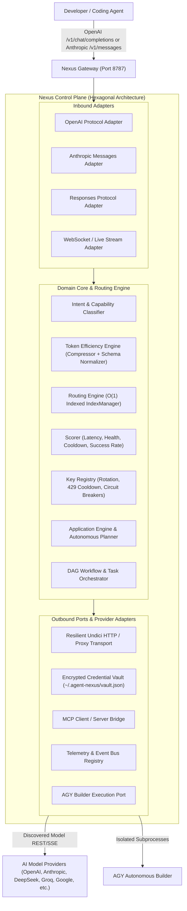
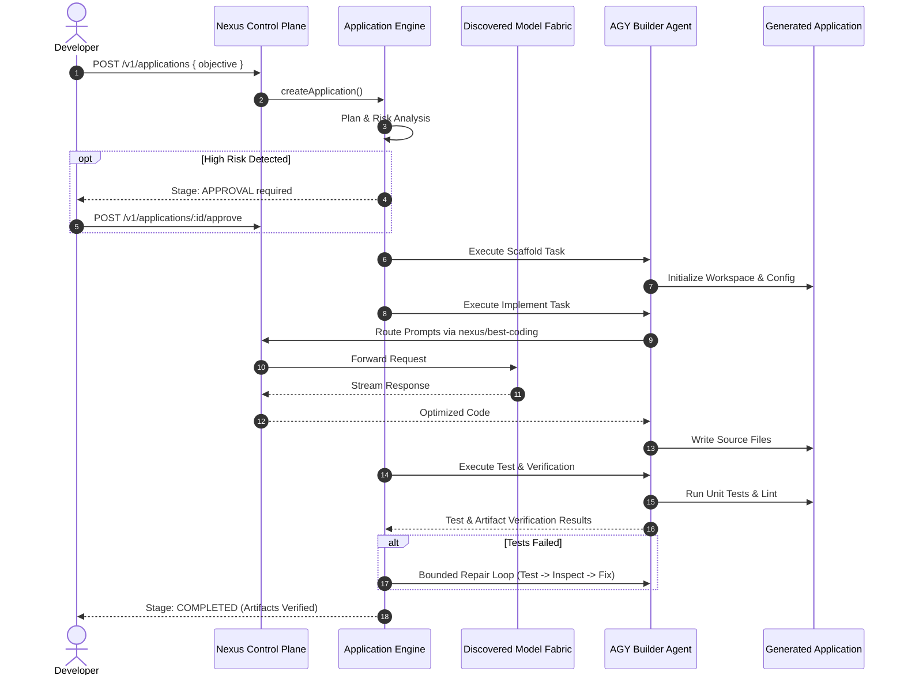

# Nexus Architecture & System Design

Nexus is a **local-first Universal AI Coding-Agent Gateway and Autonomous Control Plane**. It serves as the intelligent infrastructure layer between developer coding agents (Claude Code, Codex, OpenCode, Gemini CLI, Cursor, AGY) and multi-provider model APIs (OpenAI, Anthropic, DeepSeek, Google, Groq, Mistral, xAI, OpenRouter, Cerebras, Together, Fireworks, NVIDIA NIM).

---

## 1. High-Level Data Flow



---

## 2. Hexagonal Architecture (Ports & Adapters)

Nexus is organized following pure Clean / Hexagonal Architecture patterns:

### Core Domain (Inner Layer)
- **`packages/core`**: Pure domain logic, domain types, entities, policies, and port interfaces. Zero dependency on Fastify, HTTP servers, or external SDKs.
  - `ModelRegistry`: Aggregates dynamic models, tracks catalog versions, emits delta events.
  - `RoutingEngine`: Implements cost/latency/quality routing algorithms (`FREE`, `CHEAP`, `FAST`, `BEST`, `BEST-CODING`, `REASONING`, `VISION`, `LONG_CONTEXT`).
  - `KeyRegistry`: Multi-key rotation, 429 exponential cooldown, 401 disablement, circuit breakers.
  - `ApplicationEngine`: Autonomous software planning, scaffolding, verification, and repair cycle.
  - `AutonomousPlanner` & `RiskEngine`: Analyzes intent and enforces user approval for high-risk operations.

### Inbound Adapters (Driving Ports)
- **`apps/gateway`**: Fastify REST & WebSocket HTTP server exposing standard endpoints (`/v1/chat/completions`, `/v1/messages`, `/v1/models`, `/v1/catalog`, `/v1/applications`, `/v1/doctor`).
- **`packages/cli`**: CLI binary (`anx-gateway`) providing diagnostic and management subcommands.

### Outbound Adapters (Driven Ports)
- **`packages/providers`**: Direct REST/SSE transport implementations for all AI providers.
- **`packages/security`**: AES-256-GCM encrypted local vault, PBKDF2 key derivation, token hashing.
- **`packages/token-efficiency`**: Token counter, prompt compressor, context cache tagger, tool-schema normalizer.
- **`packages/networking`**: Proxy transport (HTTP/HTTPS/SOCKS5), DNS resolution, egress diagnostics.
- **`packages/observability`**: Telemetry ring buffers, latency percentile calculators (p50/p95/p99), event bus.
- **`packages/mcp-server` & `packages/mcp-client`**: Model Context Protocol client/server integration.

---

## 3. Subsystem Breakdown

| Subsystem | Responsibility |
|---|---|
| **Protocol Adapter** | Bidirectional translation between OpenAI format and Anthropic Messages format. |
| **Universal Model Fabric** | Normalizes discovered models across context size, pricing, speed, capability tags, and modality. |
| **Model Registry** | Dynamic background and on-demand model discovery. Increments `catalogVersion` and publishes delta changes (ETag/304). |
| **Routing Engine** | O(1) indexed candidate lookup matching requests against configured routing policies and model capabilities. |
| **Key Registry** | Per-provider multi-key rotation, rate limit isolation, and automatic failover escalation. |
| **Token Efficiency Engine** | Exact-duplicate deduplication, tool schema normalization, and context compaction reporting measured savings. |
| **Autonomous Application Engine** | Manages application build lifecycle: Discover → Specify → Architect → Plan → Approval → Scaffold → Build → Test → Verify → Repair → Finalize. |
| **AGY Builder Port** | Controlled execution port for AGY subprocess actions in isolated workspaces. |
| **Mission Control Dashboard** | Next.js 15 / React 19 operational UI for real-time traffic, provider configuration, model catalog, and metrics. |

---

## 4. AGY Application Builder Architecture



---

## 5. Security & Isolation Boundaries

- **Credential Vault**: Keys are encrypted at rest in `~/.agent-nexus/vault.json` using AES-256-GCM. Keys are never logged or echoed back.
- **Workspace Isolation**: AGY execution tasks operate within sandbox paths with explicit forbidden path guards preventing modification of the Nexus repository or system roots.
- **Security Fabric**: Strips authentication headers from outgoing responses and applies `X-Content-Type-Options: nosniff` and `Cache-Control: no-store`.

---

## 6. Phase 29: Unified Agent Mission Orchestration Fabric

Phase 29 introduces autonomous mission decomposition and DAG orchestration above individual coding agents:

```mermaid
flowchart TD
    User([User Objective]) --> MissionCtrl[Mission Control API]
    MissionCtrl --> Planner[Mission Planner]
    Planner --> RiskEngine{Risk Gate}
    RiskEngine -->|High/Critical| Approval[Awaiting Operator Approval]
    RiskEngine -->|Low/Medium| DAG[Mission Task DAG]
    Approval -->|Approved| DAG
    
    DAG --> T1[Task 1: Analysis]
    DAG --> T2[Task 2: Architecture]
    DAG --> T3[Task 3: Backend Coding]
    DAG --> T4[Task 4: Test Suite Gen]
    
    T1 & T2 & T3 & T4 --> Orch[Agent Orchestrator]
    Orch --> MultiAgent[Claude Code / Codex / Hermes / OpenCode / AGY / Gemini]
    MultiAgent --> ModelFabric[Nexus Model Fabric & Provider Routing]
    
    T3 & T4 --> RepairLoop{Test Failure?}
    RepairLoop -->|Yes (<= 3 attempts)| AutoRepair[Autonomous Repair Loop]
    AutoRepair --> Orch
    RepairLoop -->|No| Verifier[Mission Verifier]
    Verifier --> Result([Mission Completed & Checkpointed])
```

