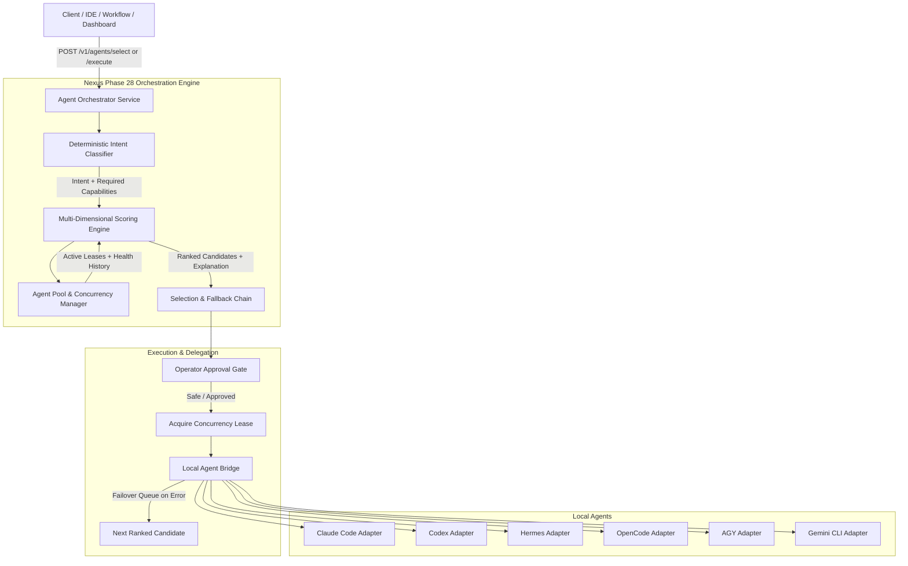

# NEXUS PHASE 28 — INTELLIGENT AGENT ORCHESTRATION FABRIC AUDIT

## Executive Summary

Phase 28 evolves Nexus from a **Universal Agent Runtime Connector** into an **Intelligent Multi-Agent Orchestration Fabric**.
Where Phase 27 established reliable, truth-checked, isolated adapters for local CLI agents (`claude-code`, `codex-cli`, `hermes-cli`, `opencode`, `agy`, `gemini-cli`), Phase 28 builds an autonomous decision and delegation layer above them.

Users and upstream callers no longer need to decide manually:
- Which local CLI agent to invoke for a task
- What model policy or routing parameters to apply
- When to fall back to an alternative agent upon failure
- How to manage local concurrent process leases without saturating the machine

All decisions are computed deterministically in under 5ms, without requiring speculative LLM calls merely to pick between agents.

---

## Orchestration Fabric Architecture

---

## Intent Classification Matrix

| Task Category | Trigger Patterns | Required Capabilities | Suggested Policy |
| :--- | :--- | :--- | :--- |
| `application-building` | build app, scaffold, create fullstack, architecture | `application-building`, `scaffolding`, `coding`, `testing`, `verification` | `nexus/application-builder` |
| `debugging` | fix bug, null pointer, exception, resolve issue | `debugging`, `coding`, `repository-edit` | `nexus/best-coding-agent` |
| `testing-debugging` | fix tests, vitest failing, unit test error | `testing`, `debugging`, `coding`, `repository-edit` | `nexus/best-coding-agent` |
| `code-review` | review pr, security audit, code smell, inspect | `repository-read`, `analysis` | `nexus/best-coding-agent` |
| `refactoring` | refactor, extract class, decouple, modernize | `refactoring`, `coding`, `repository-edit` | `nexus/best-coding-agent` |
| `feature-implementation` | implement feature, add endpoint, create component | `coding`, `repository-edit`, `repository-read` | `nexus/best-coding-agent` |
| `repository-analysis` | analyze repo, explain codebase, architecture diagram | `repository-read`, `analysis` | `nexus/fastest-agent` |
| `general-coding` | write script, convert format, code generation | `coding` | `nexus/auto` |

---

## Multi-Factor Scoring Formula

The scoring engine ranks candidate agents transparently:

$$\text{Score} = \text{CapScore} + \text{HealthScore} + \text{RelScore} + \text{LatScore} + \text{PolicyBonus} - \text{FailPenalty} - \text{LoadPenalty}$$

1. **Capability Score (0 - 40 pts):** Ratio of matched capabilities required by task intent. Special bonus (+15 pts) for specialized builders like AGY on full application creation tasks.
2. **Health Score (-50 to +30 pts):** Verified runtime health (+30 for READY, +20 for CONFIGURABLE, +15 for EXECUTABLE, -50 for uninstalled/broken).
3. **Reliability Score (0 - 20 pts):** Rolling success rate $\times 20$.
4. **Latency Score (0 - 10 pts):** P50 execution latency curve.
5. **Policy Bonus (+25 pts):** Policy matching (e.g. `nexus/prefer-claude`, `nexus/prefer-codex`, `nexus/application-builder`).
6. **Failure Penalty (consecutive failures $\times 15$ pts):** Circuit-breaker dampening to avoid cascading failures.
7. **Load Penalty (active leases $\times 10$ pts):** Concurrency balancing across system resources.

---

## Safety & Operator Approval Invariants

- High-risk operations (e.g. `rm -rf`, destructive SQL queries, credential wipes) are intercepted before delegation.
- If a task is flagged as high/critical risk, the orchestrator returns `403 Forbidden` (`requiresApproval: true`) unless explicitly approved by the human operator.
- Execution leases are strictly acquired with timeouts and guaranteed released in `finally` blocks, preventing resource leaks.
