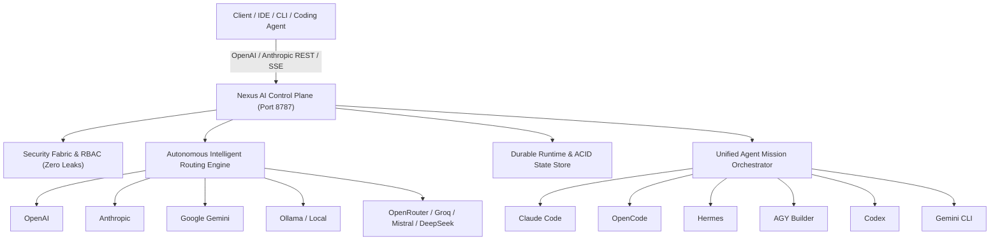

# 01 — Introduction & Overview

[Index](01-introduction-and-overview.md) | [Next: Architecture & Mental Model →](02-architecture-and-mental-model.md)

---

## What is Nexus?

**Nexus** (Agent Nexus v0.5.0) is the universal, durable, and crash-recoverable AI control plane and local gateway for autonomous engineering systems, multi-model routing, and multi-agent coordination.

Nexus bridges the gap between disparate LLM providers, local inference runtimes, and frontier coding agents (Claude Code, OpenAI Codex, Hermes, OpenCode, AGY Builder, Gemini CLI). It transforms unpredictable AI calls into an enterprise-grade, observable, deterministic, and resilient execution fabric.

---

## Core Capabilities Matrix

| Subsystem Pillar | Core Capability | Key Value Proposition |
|---|---|---|
| **1. Routing & Selection** | Multi-factor Scoring Engine | Dynamically scores candidates across latency, cost, capability match, health, and context fit. |
| **2. Dynamic Discovery** | Zero-Config Provider Onboarding | Automatically discovers models via upstream APIs and updates registry without restarts. |
| **3. Key Rotation** | Health-Aware Multi-Key Pools | Distributes load, tracks per-key rate limits, and automatically cools down exhausted credentials. |
| **4. Credential Vault** | AES-256-GCM Encrypted Storage | Secrets never touch SQLite, logs, or API responses in plaintext. |
| **5. Local Agent Bridge** | Universal Coding Agent Protocol | Standardized execution adapter for Claude Code, Codex, Hermes, OpenCode, AGY, and Gemini. |
| **6. Mission Orchestrator** | Autonomous Multi-Agent DAGs | Decomposes high-level objectives into parallel dependency graphs executed by specialized agents. |
| **7. Verification & Repair** | Closed-Loop Autonomous Repair | Validates mission outputs using linter/test runners and reassigns repair tasks on failure. |
| **8. Durable Persistence** | ACID SQLite & Atomic JSON | Persists endpoints, models, missions, checkpoints, and idempotency records with migration safety. |
| **9. Crash Recovery Engine** | Self-Healing Startup Reconciler | Detects interrupted missions upon process reboot, reconciles orphaned subprocesses, and safely resumes DAGs. |
| **10. Operations Control Plane**| 14-Subsystem Health & Telemetry | Live diagnostics with root cause explanations, SSE event streaming, and Next.js Operations Dashboard. |

---

## Design Principles

1. **Truth in Telemetry & Architecture**: No mocked states, hardcoded model catalogs, or simulated recovery. Every metric, health signal, and checkpoint corresponds to real kernel and process states.
2. **Local-First Resiliency**: Zero cloud lock-in. Nexus operates entirely offline or on local networks with local models (Ollama, vLLM, LM Studio) or seamlessly connects to cloud providers.
3. **Defense-in-Depth Security**: Strict RBAC, tenant context propagation, SSRF filtering on provider URLs, and workspace isolation for all agent executions.
4. **Idempotency & Durability**: Every mutating operation is protected by cryptographic idempotency hashing and durable checkpoints. Crashes never leave dirty or corrupt state.

---

[Index](01-introduction-and-overview.md) | [Next: Architecture & Mental Model →](02-architecture-and-mental-model.md)
