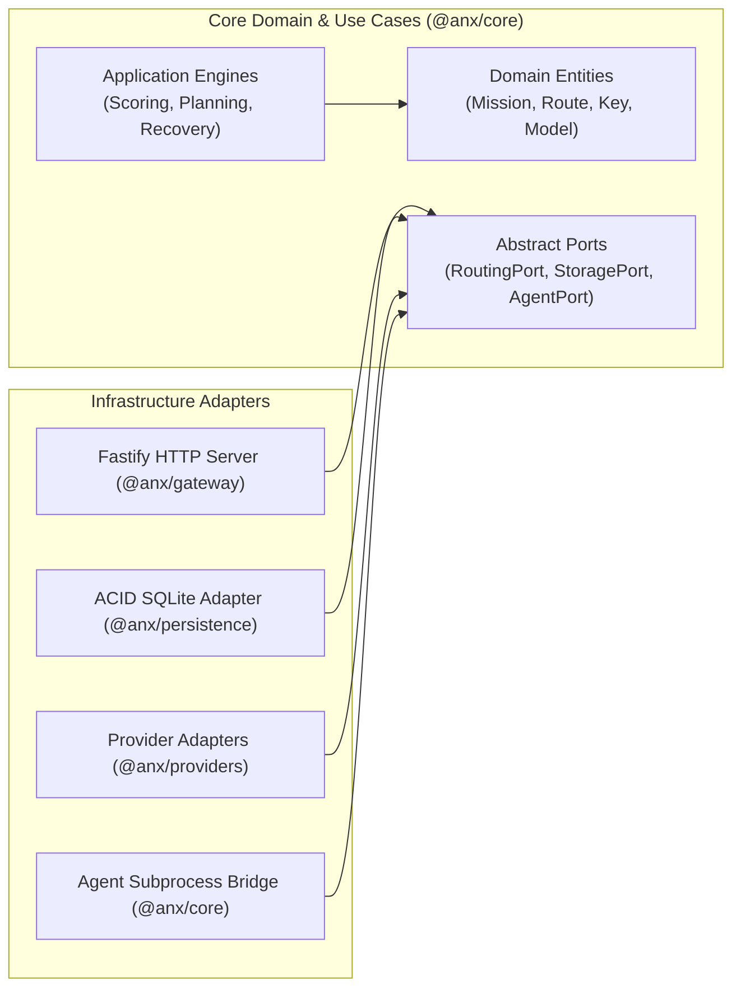
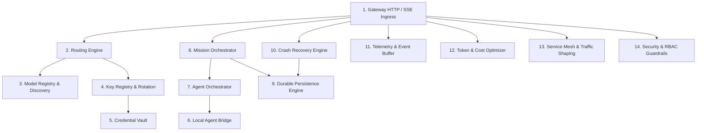

# 02 — Architecture & Mental Model

[← Previous: Introduction & Overview](01-introduction-and-overview.md) | [Index](01-introduction-and-overview.md) | [Next: Quickstart & Installation →](03-quickstart-and-installation.md)

---

## Hexagonal Architecture & Clean Ports

Nexus is built strictly upon **Hexagonal (Ports and Adapters) Architecture**. The system is decoupled into three concentric layers:

1. **Domain Layer (`packages/core/src/domain/`)**: Pure value objects, entities, events, branded types, and error classifications. Zero external I/O dependencies.
2. **Application Layer (`packages/core/src/application/`)**: Use cases, domain orchestrators, routing engines, scoring heuristics, and abstract Port interfaces.
3. **Infrastructure Layer (`packages/persistence/`, `packages/providers/`, `apps/gateway/`)**: Concrete adapters for HTTP servers, SQLite engines, process bridges, and third-party APIs.

---

## 14-Subsystem Health & Dependency Hierarchy

Nexus coordinates 14 distinct architectural subsystems. The health of the entire platform is aggregated deterministically by the `SystemHealthAggregator`.

---

## The Request Lifecycle Mental Model

When a client or agent interacts with Nexus:

1. **Ingress & Security Context**: Fastify receives the request, sets correlation headers (`x-nexus-request-id`, `x-nexus-mission-id`, `x-nexus-task-id`, `x-nexus-execution-id`), checks authorization and tenant scope via `SecurityContext`.
2. **Intent Classification & Scoring**: `IntentDetector` inspects messages, tools, and constraints. `ScoringEngine` evaluates all available models across 5 weighted dimensions.
3. **Credential Selection**: `KeyRegistry` retrieves a healthy, active API key for the selected provider from the encrypted vault and applies rotation strategies.
4. **Resilient Execution & Failover**: The provider adapter transmits the payload. If a transient error, 429, or timeout occurs, `DefaultFailover` triggers dynamic failover to the next best scored alternative.
5. **Token Accounting & Telemetry**: Response tokens, cost, latency percentiles, and request traces are recorded in the ring buffer and broadcast via SSE (`/v1/system/events`).
6. **Durable State Commit**: For missions or workflow operations, intermediate DAG states and checkpoints are written to SQLite using atomic write boundaries.

---

[← Previous: Introduction & Overview](01-introduction-and-overview.md) | [Index](01-introduction-and-overview.md) | [Next: Quickstart & Installation →](03-quickstart-and-installation.md)
