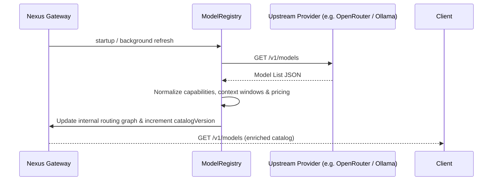

# 05 — Dynamic Model Discovery

[← Previous: Universal Provider Fabric](04-universal-provider-fabric.md) | [Index](01-introduction-and-overview.md) | [Next: Autonomous Intelligent Routing →](06-autonomous-intelligent-routing.md)

---

## Dynamic Catalog Architecture

Nexus does **not** rely on hardcoded model lists. The `ModelRegistry` actively synchronizes model metadata from upstream providers at boot and periodically in the background.



---

## Capability & Pricing Inference

When upstream models are fetched, Nexus enriches each model descriptor:

- **Context Window**: Detects max context limits (e.g. 128k, 200k, 1M, 2M tokens).
- **Capabilities**:
  - `streaming`: Server-sent event chunking.
  - `toolCalling`: Function calling / structured tool use.
  - `reasoning`: DeepSeek/o1-style chain-of-thought support.
  - `vision`: Multimodal image processing.
  - `jsonMode`: Strict JSON schema adherence.
- **Pricing Classification**:
  - `isFree`: Zero-cost models (local Ollama models, open-tier aliases).
  - `promptCostPer1k` / `completionCostPer1k`: Cost in USD.

---

## Catalog APIs

### List All Available Models
```http
GET /v1/models
```

### Filter by Capability
```http
GET /v1/models?capability=toolCalling
```

### Filter Free-Tier Only
```http
GET /v1/models?free=true
```

### Force Immediate Discovery Refresh
```http
POST /v1/models/refresh
```

---

[← Previous: Universal Provider Fabric](04-universal-provider-fabric.md) | [Index](01-introduction-and-overview.md) | [Next: Autonomous Intelligent Routing →](06-autonomous-intelligent-routing.md)
