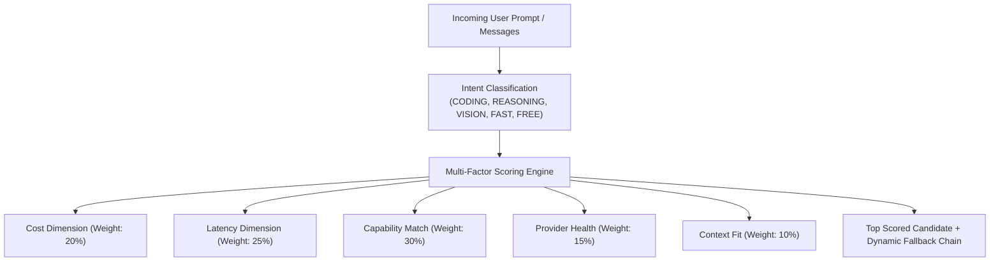

# 06 — Autonomous Intelligent Routing

[← Previous: Dynamic Model Discovery](05-dynamic-model-discovery.md) | [Index](01-introduction-and-overview.md) | [Next: Smart Model Aliasing →](07-smart-model-aliasing.md)

---

## The 5-Dimension Scoring Engine

Nexus chooses the optimal model and provider for every request using the multi-factor `ScoringEngine`.

$$\text{FinalScore} = w_{\text{cost}} \cdot S_{\text{cost}} + w_{\text{latency}} \cdot S_{\text{latency}} + w_{\text{quality}} \cdot S_{\text{quality}} + w_{\text{health}} \cdot S_{\text{health}} + w_{\text{context}} \cdot S_{\text{context}}$$



---

## Intent Detection

The `IntentDetector` inspects incoming messages, attached tools, and model requests:

- **`CODING`**: Code generation, syntax checks, refactoring, patch applications.
- **`REASONING`**: Math, formal logic, multi-hop deductions, architecture planning.
- **`TOOL_USE`**: Function calling, tool definitions, agentic execution.
- **`VISION`**: Base64 or URL image attachments.
- **`FAST`**: Latency-sensitive auto-completions and summaries.
- **`FREE`**: Strict cost-minimization / zero-spend constraints.

---

## Routing Explanation API

Inspect how Nexus arrived at a routing decision in real-time:

```http
POST /v1/routing/explain
Content-Type: application/json

{
  "messages": [
    { "role": "user", "content": "Write a distributed Raft consensus implementation in Rust" }
  ]
}
```

Response:
```json
{
  "intent": "CODING",
  "confidence": 0.95,
  "selectedCandidate": {
    "modelId": "claude-3-7-sonnet",
    "providerId": "anthropic",
    "finalScore": 94.8,
    "breakdown": {
      "costScore": 85.0,
      "latencyScore": 92.0,
      "qualityScore": 99.0,
      "healthScore": 100.0,
      "contextScore": 98.0
    }
  },
  "fallbackPath": [
    { "modelId": "gpt-4o", "providerId": "openai", "score": 91.2 },
    { "modelId": "deepseek-coder", "providerId": "deepseek", "score": 88.5 }
  ],
  "decisionExplanation": "Selected model 'claude-3-7-sonnet' on provider 'anthropic' with score 94.80 matching intent CODING."
}
```

---

[← Previous: Dynamic Model Discovery](05-dynamic-model-discovery.md) | [Index](01-introduction-and-overview.md) | [Next: Smart Model Aliasing →](07-smart-model-aliasing.md)
