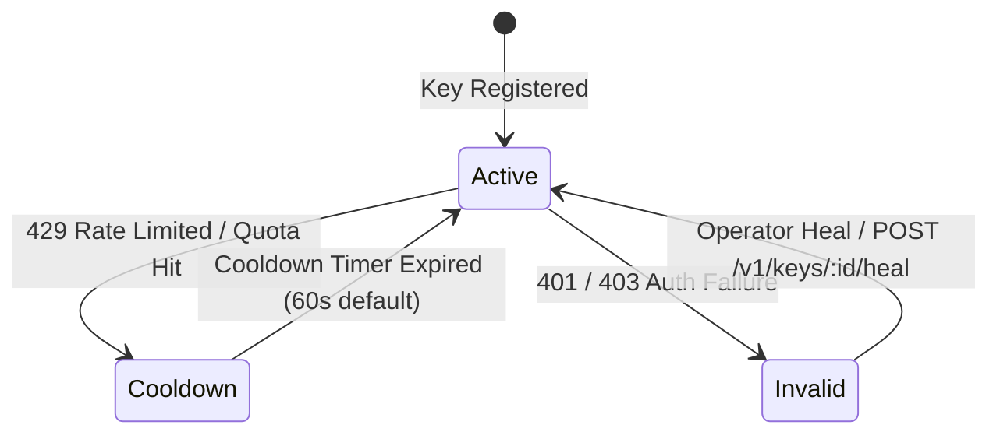

# 08 — Key Rotation & Cooldown

[← Previous: Smart Model Aliasing](07-smart-model-aliasing.md) | [Index](01-introduction-and-overview.md) | [Next: Encrypted Credential Vault →](09-encrypted-credential-vault.md)

---

## Multi-Key Pools & Rotation Strategies

Nexus supports $N$ API keys per provider. The `KeyRegistry` manages key health and distributes requests according to configurable rotation strategies:

- **`adaptive` (Default)**: Favors keys with lowest error rate and lowest latency.
- **`round-robin`**: Uniform circular distribution.
- **`least-used`**: Prioritizes keys with lowest request counts.
- **`lru`**: Prioritizes keys least recently dispatched.
- **`latency`**: Routes to the lowest average response latency.
- **`health`**: Filters out degraded keys before routing.



---

## Key Management API

### Register a Key
```http
POST /v1/keys
Content-Type: application/json

{
  "providerId": "anthropic",
  "plaintext": "sk-ant-api03-...",
  "label": "Primary Production Anthropic Key"
}
```

Response:
```json
{
  "id": "anthropic-key-m8a1b2",
  "providerId": "anthropic",
  "label": "Primary Production Anthropic Key",
  "lastFour": "...",
  "status": "active",
  "registeredAt": 1786780000000
}
```

### Self-Heal a Cooled-Down Key
```http
POST /v1/keys/anthropic-key-m8a1b2/heal
```

---

[← Previous: Smart Model Aliasing](07-smart-model-aliasing.md) | [Index](01-introduction-and-overview.md) | [Next: Encrypted Credential Vault →](09-encrypted-credential-vault.md)
