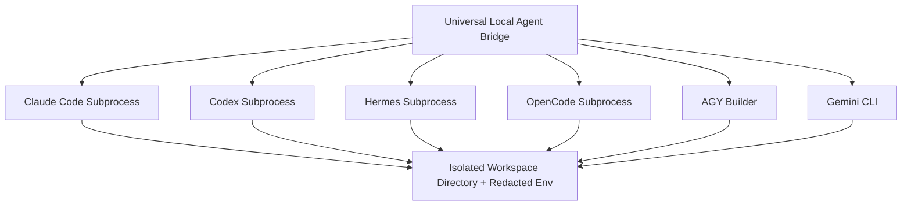

# 10 — Universal Local Agent Bridge

[← Previous: Encrypted Credential Vault](09-encrypted-credential-vault.md) | [Index](01-introduction-and-overview.md) | [Next: Agent Orchestrator & Pool →](11-agent-orchestrator-and-pool.md)

---

## Unified Agent Protocol

The **Universal Local Agent Bridge** (`packages/core/src/application/local-agent-bridge.ts`) allows Nexus to execute, lease, and orchestrate frontier coding agents across unified interfaces.

### Supported Coding Agents

| Agent | Driver / Protocol | Strengths | Workspace Isolation |
|---|---|---|---|
| **Claude Code** | Anthropic Messages REST / CLI | Architecture, deep refactoring, complex reasoning | Sandbox directory guard |
| **OpenAI Codex** | OpenAI REST / CLI | Fast completions, code generation, script writing | Workspace root isolation |
| **Hermes** | Autonomous CLI Agent | Scaffold generation, multi-file code editing | Working directory boundary |
| **OpenCode** | OpenCode AI Protocol | Multi-model open agent execution | Workspace boundary enforcement |
| **AGY Builder** | Full-Stack Scaffolding Engine | Project initialization, frontend/backend generation | Dedicated workspace subfolder |
| **Gemini CLI** | Google Gemini Protocol | Long-context repo analysis, documentation | Read/write workspace boundary |



---

## Agent Detection & Health

Nexus auto-detects installed coding agents on the host system:

```http
GET /v1/agents/health
```

Response:
```json
{
  "agents": [
    { "agentId": "claude-code", "installed": true, "version": "1.0.4", "health": "healthy" },
    { "agentId": "hermes", "installed": true, "version": "0.4.2", "health": "healthy" },
    { "agentId": "opencode", "installed": true, "version": "0.8.0", "health": "healthy" },
    { "agentId": "agy-builder", "installed": true, "version": "0.5.0", "health": "healthy" },
    { "agentId": "codex", "installed": false, "health": "uninstalled" },
    { "agentId": "gemini", "installed": true, "version": "0.3.1", "health": "healthy" }
  ]
}
```

---

[← Previous: Encrypted Credential Vault](09-encrypted-credential-vault.md) | [Index](01-introduction-and-overview.md) | [Next: Agent Orchestrator & Pool →](11-agent-orchestrator-and-pool.md)
