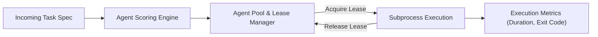

# 11 — Agent Orchestrator & Pool

[← Previous: Universal Local Agent Bridge](10-universal-local-agent-bridge.md) | [Index](01-introduction-and-overview.md) | [Next: Unified Mission Orchestration →](12-unified-mission-orchestration.md)

---

## Agent Leasing & Concurrency Control

The `AgentOrchestrator` manages execution concurrency, leases, and scoring across available local agents:

- **Concurrency Limits**: Ensures agent subprocesses do not exhaust host CPU/memory resources (default: 4 concurrent executions).
- **Lease Allocation**: Grants a lease to an agent for a specific task duration; automatically releases the lease on completion or crash.
- **Dynamic Agent Scoring**: Selects the best agent based on task requirements (`CODE_SCAFFOLD`, `CODE_IMPLEMENT`, `CODE_REVIEW`, `TEST_EXECUTE`, `VERIFICATION`, `DOCUMENTATION`).



---

## Agent Orchestration API

### Trigger Agent Execution
```http
POST /v1/agents/execute
Content-Type: application/json

{
  "task": {
    "taskId": "task-scaffold-db",
    "name": "Scaffold Database Migrations",
    "kind": "CODE_IMPLEMENT",
    "requiredCapabilities": ["code_generation", "file_system_write"]
  },
  "preferredAgent": "claude-code",
  "workspace": "/tmp/nexus-workspaces/proj-1"
}
```

### Cancel In-Flight Execution
```http
POST /v1/agents/executions/exec-88219/cancel
```

---

[← Previous: Universal Local Agent Bridge](10-universal-local-agent-bridge.md) | [Index](01-introduction-and-overview.md) | [Next: Unified Mission Orchestration →](12-unified-mission-orchestration.md)
