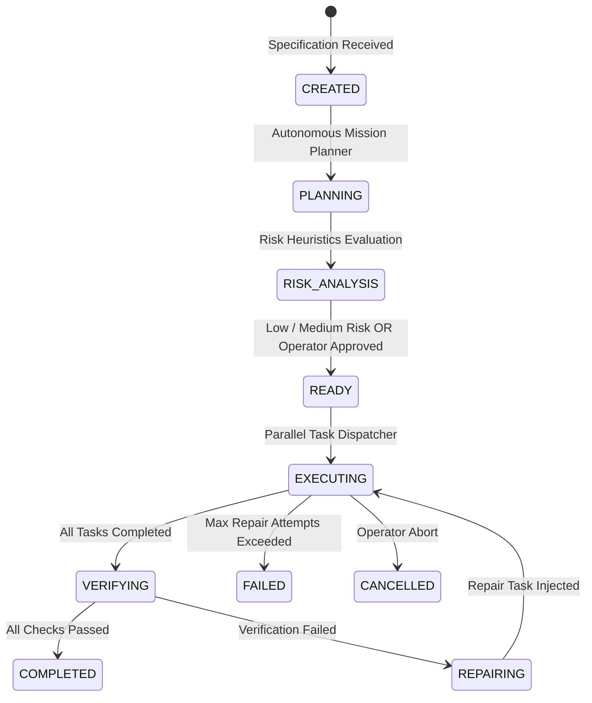

# 12 — Unified Mission Orchestration

[← Previous: Agent Orchestrator & Pool](11-agent-orchestrator-and-pool.md) | [Index](01-introduction-and-overview.md) | [Next: Mission DAG & Parallel Execution →](13-mission-dag-and-parallel-execution.md)

---

## What is a Mission?

A **Mission** is a high-level, declarative software objective decomposed by Nexus into a multi-step, multi-agent dependency graph.

Instead of running single prompt-response loops, Nexus coordinates autonomous teams of agents to plan, architect, implement, test, verify, and document software systems.



---

## Mission Specification API

### Create a Mission
```http
POST /v1/missions
Content-Type: application/json
Idempotency-Key: mission-build-billing-service-v1

{
  "objective": "Build a multi-tier subscription billing microservice in TypeScript with Stripe webhooks",
  "maxCostUsd": 15.0,
  "autoApprove": true,
  "workspace": "/home/developer/projects/billing-service"
}
```

Response:
```json
{
  "id": "mission-m817a-99",
  "status": "READY",
  "spec": {
    "objective": "Build a multi-tier subscription billing microservice in TypeScript with Stripe webhooks",
    "maxCostUsd": 15.0
  },
  "plan": {
    "planId": "plan-b199",
    "tasks": [
      { "taskId": "t1", "name": "Architecture & Schema", "kind": "CODE_SCAFFOLD", "status": "PENDING" },
      { "taskId": "t2", "name": "Stripe Webhook Handler", "kind": "CODE_IMPLEMENT", "status": "PENDING" },
      { "taskId": "t3", "name": "Unit & Integration Tests", "kind": "TEST_EXECUTE", "status": "PENDING" },
      { "taskId": "t4", "name": "Verification", "kind": "VERIFICATION", "status": "PENDING" }
    ],
    "totalEstimatedCostUsd": 2.40
  },
  "createdAt": 1786780000000
}
```

---

[← Previous: Agent Orchestrator & Pool](11-agent-orchestrator-and-pool.md) | [Index](01-introduction-and-overview.md) | [Next: Mission DAG & Parallel Execution →](13-mission-dag-and-parallel-execution.md)
