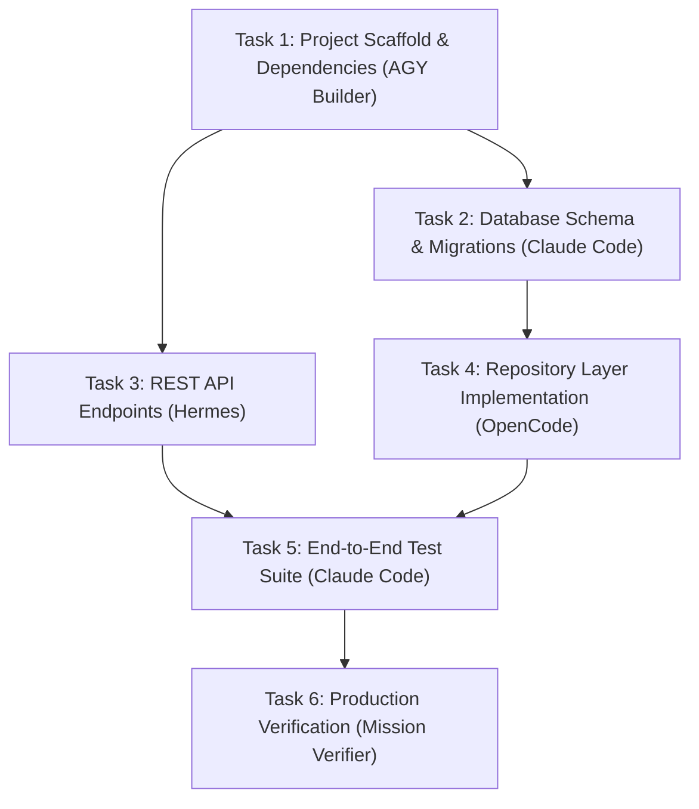

# 13 — Mission DAG & Parallel Execution

[← Previous: Unified Mission Orchestration](12-unified-mission-orchestration.md) | [Index](01-introduction-and-overview.md) | [Next: Autonomous Verification & Repair →](14-autonomous-verification-and-repair.md)

---

## Directed Acyclic Graph (DAG) Engine

The `MissionPlanner` transforms raw objectives into a validated topological DAG (`packages/core/src/application/dag-engine.ts`).

- **Dependency Graph**: Tasks specify prerequisites via `dependsOn: string[]`.
- **Topological Sorting**: Independent tasks execute in parallel up to the configured worker limit.
- **Cycle Detection**: Validates graphs at plan time to prevent deadlocks.



---

## Parallel Execution Lifecycle

1. **Ready Queue**: Tasks whose dependencies are all `COMPLETED` enter the `READY` state.
2. **Lease Acquisition**: The scheduler requests an available agent with matching capabilities from the `AgentPool`.
3. **Execution & Checkpoint**: Upon task completion, the DAG state is updated, a `MissionCheckpoint` is committed to SQLite, and downstream tasks are unlocked.

---

## Real-Time DAG Streaming API

Stream live DAG task state transitions over Server-Sent Events:

```http
GET /v1/missions/mission-m817a-99/events
```

SSE Output:
```
event: mission.task.started
data: {"taskId":"t1","agentId":"agy-builder","timestamp":1786780001000}

event: mission.task.completed
data: {"taskId":"t1","status":"COMPLETED","tokensSpent":1400,"durationMs":3200}

event: mission.task.started
data: {"taskId":"t2","agentId":"claude-code","timestamp":1786780004500}
```

---

[← Previous: Unified Mission Orchestration](12-unified-mission-orchestration.md) | [Index](01-introduction-and-overview.md) | [Next: Autonomous Verification & Repair →](14-autonomous-verification-and-repair.md)
