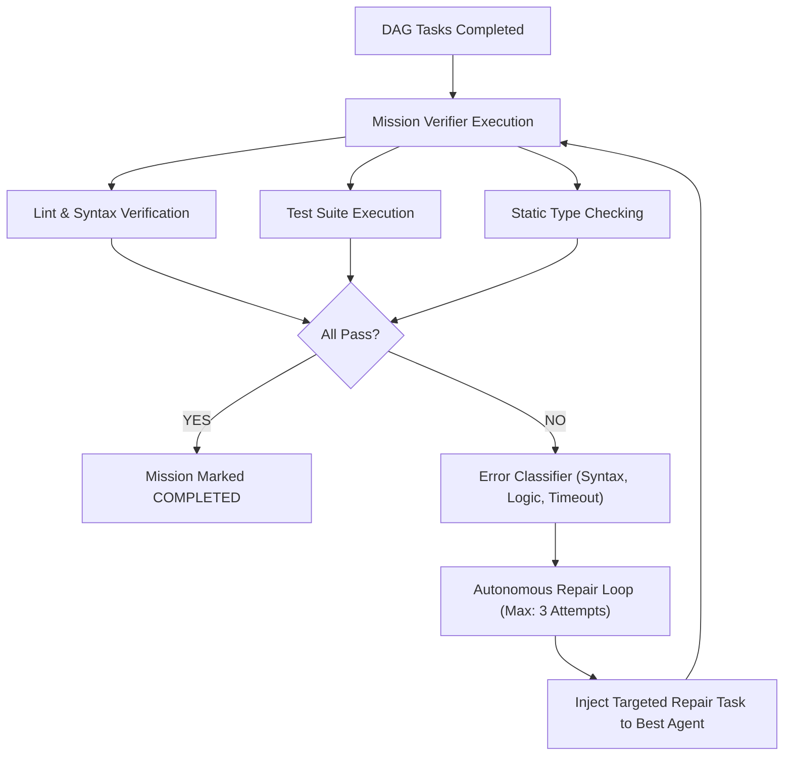

# 14 — Autonomous Verification & Repair

[← Previous: Mission DAG & Parallel Execution](13-mission-dag-and-parallel-execution.md) | [Index](01-introduction-and-overview.md) | [Next: Durable Runtime & Persistence →](15-durable-runtime-and-persistence.md)

---

## Closed-Loop Verification Model

Nexus does not rely on LLM self-assessment. The `MissionVerifier` (`packages/core/src/application/mission/mission-verifier.ts`) runs concrete programmatic gates against the workspace:

1. **Compilation & Syntax Check**: `tsc --noEmit`, `cargo check`, `go build`, `python -m py_compile`.
2. **Lint & Formatting**: `eslint`, `biome`, `ruff`, `golangci-lint`.
3. **Automated Test Suite**: `vitest`, `jest`, `pytest`, `cargo test`.
4. **Security Vulnerability Scan**: Secret scanner & dependency auditor.

---

## Error Classification & Targeted Repair

When a verification check fails, `classifyFailure()` diagnoses the root cause:
- **`COMPILATION_ERROR`**: Injects precise compiler output into the prompt.
- **`TEST_FAILURE`**: Passes stack trace, expected vs. received diff to the repair agent.
- **`AGENT_CRASH`**: Automatically swaps to an alternative agent (e.g. Claude Code fallback).

---

[← Previous: Mission DAG & Parallel Execution](13-mission-dag-and-parallel-execution.md) | [Index](01-introduction-and-overview.md) | [Next: Durable Runtime & Persistence →](15-durable-runtime-and-persistence.md)
