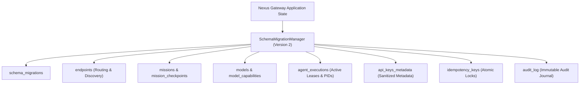

# 15 — Durable Runtime & Persistence

[← Previous: Autonomous Verification & Repair](14-autonomous-verification-and-repair.md) | [Index](01-introduction-and-overview.md) | [Next: Crash Recovery & Reconciliation →](16-crash-recovery-and-reconciliation.md)

---

## ACID Durability Architecture

Nexus v0.5.0 features a local-first **Durable Persistence Engine** (`@anx/persistence`) designed to survive process crashes, server reboots, and ungraceful kills:

1. **Storage Backing**: SQLite (Node 22+ `node:sqlite` or cross-platform fallback) with Write-Ahead Logging (WAL).
2. **Schema Versioning**: Versioned migration manager (`SchemaMigrationManager`) ensuring forward and backward migration integrity.
3. **Atomic File Backing**: `AtomicJsonStore` uses write-to-temp + atomic rename guarantees across Windows, macOS, and Linux.



---

## Schema Version 2 Entity Models

| Table Name | Primary Key | Key Fields | Purpose |
|---|---|---|---|
| `schema_migrations` | `version` | `description`, `applied_at` | Tracks applied database migrations |
| `endpoints` | `id` | `data` (JSON), `updated_at` | Stores configured provider endpoints |
| `missions` | `id` | `status`, `data` (JSON), `updated_at` | Stores mission specifications and DAG plans |
| `mission_checkpoints` | `id` | `mission_id`, `timestamp`, `data` | Immutable mission execution checkpoints |
| `models` | `id` | `provider_id`, `data`, `updated_at` | Dynamic model discovery catalog |
| `agent_executions` | `execution_id` | `agent_id`, `mission_id`, `pid`, `status` | Tracks subprocess leases & process liveness |
| `api_keys_metadata` | `key_id` | `provider_id`, `status`, `data` | Key health & rotation stats (no secrets) |
| `idempotency_keys` | `key` | `request_hash`, `status`, `response_body` | Idempotency locks & cached responses |
| `audit_log` | `id` | `occurred_at`, `principal`, `action`, `result` | Immutable security & access audit logs |

---

## Database Configuration

```bash
# Path to SQLite database file (default: ~/.agent-nexus/nexus.db)
export NEXUS_DB_PATH="/var/lib/agent-nexus/nexus.db"
```

---

[← Previous: Autonomous Verification & Repair](14-autonomous-verification-and-repair.md) | [Index](01-introduction-and-overview.md) | [Next: Crash Recovery & Reconciliation →](16-crash-recovery-and-reconciliation.md)
