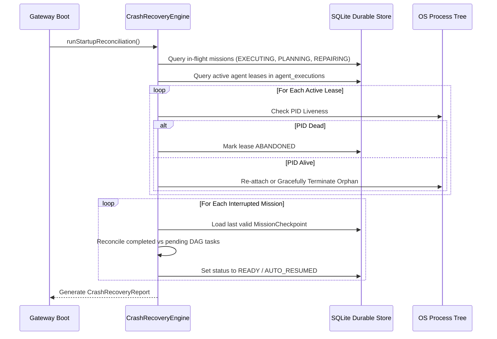

# 16 — Crash Recovery & Reconciliation

[← Previous: Durable Runtime & Persistence](15-durable-runtime-and-persistence.md) | [Index](01-introduction-and-overview.md) | [Next: Idempotency & Side-Effect Safety →](17-idempotency-and-side-effect-safety.md)

---

## Startup Reconciliation Lifecycle

The `CrashRecoveryEngine` (`packages/core/src/application/crash-recovery-engine.ts`) executes automatically upon gateway startup before accepting traffic:



---

## Recovery Diagnostic API

### Inspect Recovery Report
```http
GET /v1/system/recovery
```

Response:
```json
{
  "timestamp": 1786780000000,
  "startupDurationMs": 42,
  "status": "RECOVERED",
  "durableStorageAvailable": true,
  "schemaVersion": 2,
  "interruptedMissions": [
    {
      "missionId": "mission-m817a-99",
      "objective": "Build billing service",
      "status": "READY",
      "lastCheckpointAt": 1786779950000,
      "completedTasksCount": 2,
      "interruptedTasksCount": 1,
      "totalTasksCount": 4,
      "reconciliationStatus": "AUTO_RESUMED",
      "suggestedAction": "RESUME"
    }
  ],
  "abandonedExecutions": [],
  "rehydratedModelsCount": 45,
  "rehydratedProvidersCount": 8,
  "summary": {
    "totalInterruptedMissions": 1,
    "autoResumedMissions": 1,
    "abandonedMissions": 0,
    "totalAbandonedExecutions": 0,
    "quarantinedCorruptCheckpoints": 0
  }
}
```

### Operator Reconcile Action
```http
POST /v1/system/recovery/reconcile
Content-Type: application/json

{
  "missionId": "mission-m817a-99",
  "action": "RESUME"
}
```

Supported actions: `RESUME`, `RETRY`, `CANCEL`, `REPAIR`, `DISCARD`.

---

[← Previous: Durable Runtime & Persistence](15-durable-runtime-and-persistence.md) | [Index](01-introduction-and-overview.md) | [Next: Idempotency & Side-Effect Safety →](17-idempotency-and-side-effect-safety.md)
