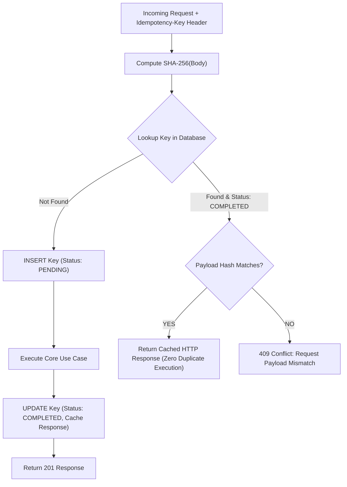

# 17 — Idempotency & Side-Effect Safety

[← Previous: Crash Recovery & Reconciliation](16-crash-recovery-and-reconciliation.md) | [Index](01-introduction-and-overview.md) | [Next: Backup & Disaster Recovery →](18-backup-and-disaster-recovery.md)

---

## Idempotency Engine Overview

To protect against network retries, duplicate client requests, and partial gateway crashes, Nexus provides **Cryptographic Idempotency Protection** via `DurableIdempotencyStore`.



---

## Usage in API Calls

Pass the `Idempotency-Key` or `x-idempotency-key` header on mutating POST endpoints:

```bash
curl -X POST http://127.0.0.1:8787/v1/missions \
  -H "Content-Type: application/json" \
  -H "Idempotency-Key: deploy-staging-build-42" \
  -d '{"objective": "Deploy staging build", "autoApprove": true}'
```

If the connection drops or the client times out, repeating the exact same curl command will instantly return the previously created mission without creating duplicate runs or wasting LLM tokens.

---

[← Previous: Crash Recovery & Reconciliation](16-crash-recovery-and-reconciliation.md) | [Index](01-introduction-and-overview.md) | [Next: Backup & Disaster Recovery →](18-backup-and-disaster-recovery.md)
