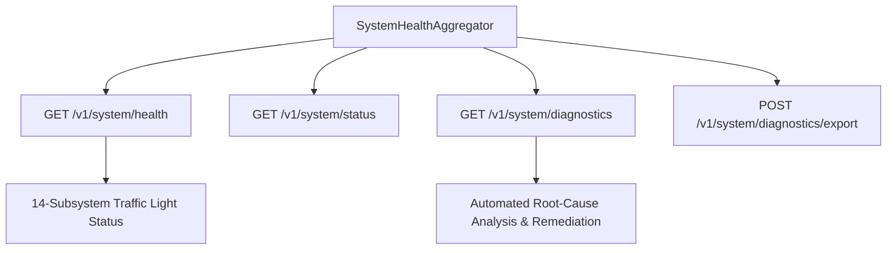

# 19 — Operations Control Plane

[← Previous: Backup & Disaster Recovery](18-backup-and-disaster-recovery.md) | [Index](01-introduction-and-overview.md) | [Next: Observability, Metrics & Traces →](20-observability-metrics-and-traces.md)

---

## 14-Subsystem Truthful Health Model

The **Operations Control Plane** evaluates all 14 architectural pillars in real-time via `SystemHealthAggregator`.

---

## Control Plane Endpoints

| Endpoint | Method | Output Format | Purpose |
|---|---|---|---|
| `/v1/system/health` | GET | JSON | Complete multi-subsystem status, latency, error count |
| `/v1/system/status` | GET | JSON | Lightweight operational summary (version, uptime, status) |
| `/v1/system/diagnostics` | GET | JSON | Root-cause analysis with concrete remediation steps |
| `/v1/system/diagnostics/export` | POST | JSON / Markdown | Export full system diagnostic report |
| `/v1/system/recovery` | GET | JSON | Crash recovery report & in-flight interrupted missions |
| `/v1/system/recovery/reconcile` | POST | JSON | Trigger operator-directed mission recovery action |
| `/v1/system/backup` | POST | JSON | Generate verifiable backup snapshot bundle |
| `/v1/system/restore` | POST | JSON | Restore platform state from backup bundle |

---

[← Previous: Backup & Disaster Recovery](18-backup-and-disaster-recovery.md) | [Index](01-introduction-and-overview.md) | [Next: Observability, Metrics & Traces →](20-observability-metrics-and-traces.md)
