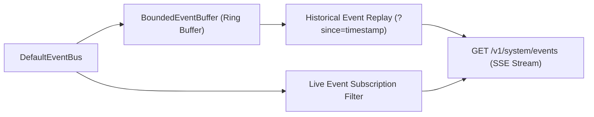

# 21 — Realtime Events & Telemetry Streaming

[← Previous: Observability, Metrics & Traces](20-observability-metrics-and-traces.md) | [Index](01-introduction-and-overview.md) | [Next: Production Operations Dashboard →](22-production-operations-dashboard.md)

---

## Bounded Ring Buffer & SSE Ingress

Nexus captures all domain events into an in-memory **Bounded Ring Buffer** (`BoundedEventBuffer`, 1,000 capacity default) for zero-latency replay and live SSE telemetry streaming.



---

## SSE Stream Consumption

Connect to the live stream with correlation or event type filters:

```bash
# Stream all system telemetry
curl -N http://127.0.0.1:8787/v1/system/events

# Stream only mission events
curl -N "http://127.0.0.1:8787/v1/system/events?type=mission"

# Stream events for specific correlation ID
curl -N "http://127.0.0.1:8787/v1/system/events?correlationId=req-88912"
```

---

[← Previous: Observability, Metrics & Traces](20-observability-metrics-and-traces.md) | [Index](01-introduction-and-overview.md) | [Next: Production Operations Dashboard →](22-production-operations-dashboard.md)
